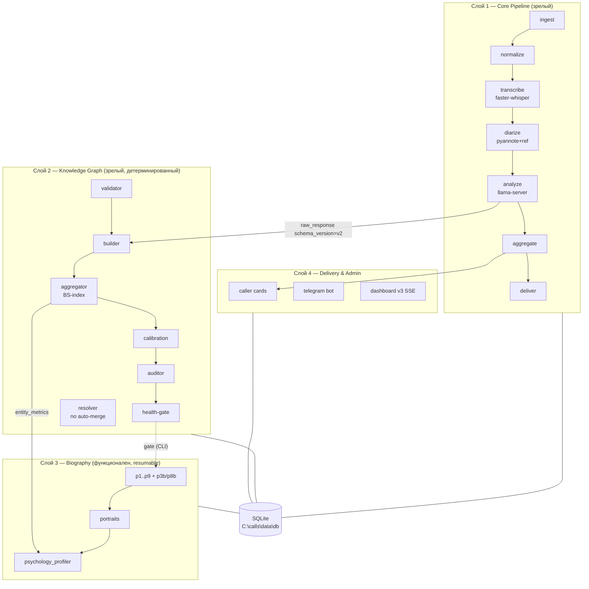

# CallProfiler — Архитектура v5 (источник истины по коду)

> **Дата:** 2026-05-29 · **Supersedes:** `ARCHITECTURE_v3.md`, `ARCHITECTURE_v4.md`
> **Принцип:** при любом расхождении с другими документами истина — **в коде и в `configs/*.yaml`**, затем в этом файле.
> **Принципы и запреты** (локальность, изоляция `user_id`, GPU-дисциплина, no-swallow) — по-прежнему задаёт `CONSTITUTION.md`. Этот файл их не отменяет, а описывает **фактически построенную систему**.

---

## 0. Что изменилось относительно v4

`ARCHITECTURE_v4.md` описывал систему **до Фазы 4** (pipeline + карточки + contact_summaries). С тех пор в код добавлены **два крупных слоя и админка**, которых нет ни в одном архитектурном доке:

- **Knowledge Graph** (`graph/`) — детерминированные сущности/связи/метрики, BS-index, калибровка, аудитор, валидатор, replay, health-gate.
- **Biography** (`biography/`) — 11-проходный LLM-конвейер (p1–p9 + p3b/p8b), портреты, психопрофили (темперамент / Big Five / мотивация), resume через checkpoints + memoization.
- **Dashboard v3** (`dashboard/`) — FastAPI + SSE, 5 вкладок, read-only БД.

**Исправленные факт-ошибки доков (verified 2026-05-29):**

| Что | Доки врали | Истина (где) |
|---|---|---|
| LLM-движок | CONSTITUTION Ст.3/5/9 «Ollama» | **llama-server (llama.cpp)** — `config.py:21`, `base.yaml:11` |
| Корень данных | CLAUDE.md «D:\calls» | **`C:\calls\data`** — `base.yaml:1` |
| Объём системы | v4 — до Фазы 4 | **+graph +biography +dashboard** (этот файл) |

---

## 1. Карта слоёв



**Поток данных одной фразой:** аудио → транскрипт → диаризация → LLM выдаёт JSON (`schema_version=v2` с `entities/relations/structured_facts`) → граф детерминированно агрегирует факты в `entities/relations/entity_metrics` → biography по запросу строит книгу и психопрофили → доставка через карточки/Telegram/dashboard.

---

## 2. Слой 1 — Core Pipeline

**Назначение:** аудиофайл → запись `calls` + `transcripts` + `analyses`. Зрелый, соответствует v4.

| Шаг | Модуль | Заметки |
|---|---|---|
| Ingest | `ingest/ingester.py`, `ingest/filename_parser.py` | MD5-дедуп по `user_id` (`ingester.py:111`); парсер имён 5 форматов + кириллик-антимусор |
| Normalize | `audio/normalizer.py` | ffmpeg → WAV 16k mono |
| Transcribe | `transcribe/whisper_runner.py`, `transcript_cleaner.py` | faster-whisper large-v3 / cuda / float16 / ru; `unload()` есть |
| Diarize | `diarize/pyannote_runner.py`, `role_assigner.py` | pyannote 3.3.2 + ref-embedding → OWNER/OTHER; пустая диаризация → speaker=UNKNOWN |
| Analyze | `analyze/service.py` + `analyze/*` | см. §7 |
| Aggregate | `aggregate/summary_builder.py` | `contact_summaries`, 90-дн. decay, калиброванный emoji |
| Deliver | `deliver/*` | см. §6 (Слой 4) |

**Два пути обработки:**
- **Real-time:** `pipeline/watcher.py` → `ingester` → `pipeline/orchestrator.py::process_batch`.
- **Bulk:** `bulk/loader.py` (массовый импорт .txt, status='done') + `bulk/enricher.py` (LLM-анализ пачкой).

**GPU-дисциплина (CONSTITUTION Ст.9.3 — соблюдена):** в `process_batch` Whisper грузится → транскрибит все → `whisper_runner.unload()` (`orchestrator.py:276`) → затем фаза diarize → затем фаза LLM. Две тяжёлые модели не сосуществуют.

**Ошибки:** per-call `try/except` → `update_call_status(call_id,"error",msg)` → `continue`; нет голых except; retry-счётчик `max_retries=3`.

> ⚠️ **Известный пробел (см. §9 #1):** если `pyannote.diarize()` **бросает исключение** (не пустой результат, а краш), блок `orchestrator.py:294-305` не доходит до `save_transcripts` → корректный Whisper-транскрипт **теряется**, звонок → `error`. Нарушает graceful-degradation из `pipeline.md` на пути-исключения.

---

## 3. Слой 2 — Knowledge Graph

**Назначение:** детерминированно превратить LLM-факты в граф сущностей с метриками доверия. **Отдельная схема** от biography (`entities` ≠ `bio_entities`). Документ-контракт: `.claude/rules/graph.md`.

**Три слоя (соблюдены):** extraction (LLM→`analyses.raw_response`, `v2`) → **aggregation (чистый Python, без LLM)** → interpretation (будущие LLM-проходы читают метрики, не транскрипт).

| Механизм | Модуль | Состояние |
|---|---|---|
| Builder | `graph/builder.py` | v1 skip / v2 process; anti-noise (confidence≥0.6, len(quote)≥5); dedup `fact_id`=sha256 |
| Aggregator | `graph/aggregator.py` | BS-index `v1_linear` (0.40 broken + 0.20 contradiction + 0.15 vagueness + 0.15 blame + 0.10 emotional); сырые счётчики в `entity_metrics` |
| Validator | `graph/validator.py` | проверка дословности цитаты (fuzzy 0.72), speaker-attribution |
| Calibration | `graph/calibration.py` | пороги риска по перцентилям p25/p50/p75/p90 → `bs_thresholds` |
| Auditor | `graph/auditor.py` | 9 проверок, 2 CRITICAL: owner_contamination, orphan_events |
| Replay | `graph/replay.py` | идемпотентная пересборка (DELETE→UPDATE→rebuild) |
| Resolver | `graph/resolver.py`, `llm_disambiguator.py` | **неконтролируемый auto-merge запрещён** (dry-run обязателен; LLM-арбитр зоны 0.50–0.64 — advisory, не авто, cap 50/run); merge аудируется в `entity_merges` |
| Health-gate | CLI `graph-health` | 4 проверки, exit 0 обязателен перед biography |

**Таблицы:** `entities`, `relations`, `entity_metrics`, `events`(+7 graph-колонок), `bs_thresholds`, `entity_merges`.

**Вердикт:** сложность оправдана — каждый механизм закрывает реальный класс ошибок (двойной счёт, ложные merge, дрейф BS, фантомные цитаты). Не overengineering.

---

## 4. Слой 3 — Biography

**Назначение:** транскрипты → книга + портреты персонажей + психопрофили. Конвейер из 11 проходов. Контракты: `.claude/rules/biography-{data,prompts,style}.md`, `src/callprofiler/biography/CLAUDE.md`.

**Проходы** (`biography/orchestrator.py`, порядок `p1→p2→p3→p3b→p4→p5→p6→p8→p8b→p7→p9`):

| Pass | Файл | Выход |
|---|---|---|
| p1 scene | `p1_scene.py` | JSON: importance/type/synopsis/key_quote/entities (long-call smart-clip) |
| p2 entities | `p2_entities.py` | JSON: canonical + aliases + role + **description** |
| p3 threads / p3b behavioral | `p3_threads.py`, `p3b_behavioral.py` | JSON: нить по сущности + поведенческое обогащение |
| p4 arcs | `p4_arcs.py` | JSON: сюжетные арки |
| p5 portraits | `p5_portraits.py` | JSON: **prose + traits + relationship + what_owner_learned** |
| p6 chapters | `p6_chapters.py` | markdown главы (читает граф через `data_extractor.py`) |
| p7 book / p8 editorial / p8b dedup / p9 yearly | `p7_book.py`,`p8_editorial.py`,`p8b_doc_dedup.py`,`p9_yearly.py` | рамка книги, редактура, дедуп, годовой итог |

**«Персонаж с характеристиками» собран из 3 источников:** `bio_entities.description` (p2) + `bio_portraits`(prose/traits/relationship) (p5) + `psychology_profiler.py` (темперамент / Big Five OCEAN / McClelland-мотивация, читает `entity_metrics` графа). *См. §9 #6 — единого read-контракта пока нет.*

**Resume:** `bio_checkpoints` (прогресс по проходу) + `bio_llm_calls` (memoization по MD5 промпта) → многодневный прогон переживает краш без переплаты токенов. `PROMPT_VERSION="bio-v10"`; bump ломает кэш.

> ⚠️ **Долг (§9 #4):** в `prompts.py` сосуществуют legacy `BUDGETS` (реально используется всеми проходами) и `BASELINE_BUDGETS`/`calculate_dynamic_budget` (мёртвый код). Задача P0-019.

---

## 5. LLM-подсистема

- **Клиент:** `analyze/llm_client.py` — `requests.post` к **llama-server** OpenAI-формата `http://127.0.0.1:8080/v1/chat/completions`. Не Ollama, не openai-SDK. Timeout 300с.
- **Resilient-обёртка:** `biography/llm_client.py` добавляет retry+backoff и memoization. Не дублирование — слой поверх базового клиента.
- **Парсер:** `analyze/response_parser.py` — 4 ступени (direct → markdown-fence → bounds → repair обрезанного JSON), enum `parse_status` (parsed_ok/parsed_partial/output_truncated/parse_failed), на провале → дефолтный `Analysis` + сохранён `raw_response`. Не глотает.
- **Промпт:** `configs/prompts/analyze_v001.txt` эмитит `schema_version="v2"` с `entities/relations/structured_facts` (вход для графа). `prompt_version` пишется в `analyses`.
- **Бюджет:** `analyze/prompt_budget.py` (head+middle+tail клиппинг); biography использует адаптивные 12K–32K симв./проход.

> Замечание: `.claude/rules/llm.md` устарел (пишет «Ollama», «лимит 3000 симв») — реальные лимиты см. `prompt_budget.py` и `biography/prompts.py`.

---

## 6. Слой 4 — Delivery & Admin

| Поверхность | Модуль | Состояние |
|---|---|---|
| Caller cards | `deliver/card_generator.py` | структурированный формат header/risk/hook/bullets/advice, ≤512 байт, калиброванный emoji (BSCalibrator) — **работает** |
| Telegram | `deliver/telegram_bot.py` | `TelegramNotifier`, токен только из `os.environ`; команды /digest /search /contact /promises /status; **OFF по умолчанию** (`features.yaml:30`) — спит, пока не включён |
| Dashboard | `dashboard/server.py`, `db_reader.py`, `models.py`, `tools.py` | FastAPI v3, 5 вкладок; БД **read-only** (`db_reader.py:30` `file:…?mode=ro`); bind 127.0.0.1; `escapeHtml` в app.js |

**Dashboard — реальное vs заглушки (по аудиту):**
- **Реальные данные:** `/api/overview`, `/api/calls`, `/api/calls/{id}`, `/api/search` (FTS5), `/api/entities`, `/api/system`.
- **Заглушки/частично:** SSE `/api/sse` шлёт только `tick` (не реальные события pipeline); часть v2-compat роутов и admin-POST (retry/extract/rebuild) подключены лишь при инициализированном `_TOOLS`; **CSV-экспорта нет** (toast-заглушка).

**CLI:** `cli/main.py` (модульный) + `cli/commands/{admin,bulk,query,contacts,graph,biography}.py` — ~32 подкоманды (watch/process/reprocess/add-user/status/dashboard/bot, bulk-load/-enrich/extract-names, digest/search/promises/analytics, rebuild-summaries/-cards/book-chapter/person-profile/profile-all, biography-run/-status/-export, graph-backfill/-replay/-audit/-health/entity-merge…).

---

## 7. Хранение и пути (factual)

**Корень:** `data_dir = C:\calls\data` (`base.yaml:1`). Лог: `C:\calls\data\logs\pipeline.log`.

```
C:\calls\data\
├── db\callprofiler.db                         ← одна БД на всех, изоляция по user_id
├── logs\pipeline.log
└── users\{user_id}\
    └── audio\
        ├── originals\{call_id}.<ext>          ← read-only копии (Ст.6.1)
        └── normalized\{call_id}.wav           ← WAV 16k mono
```

> ⚠️ **Пробел (§9 #2):** аудио лежит **плоско** в одной папке на пользователя — нет иерархии год/месяц. При десятках тысяч файлов → деградация ФС.

---

## 8. Известные пробелы и тех-долг (аудит 2026-05-29)

| # | Пробел | Где | Стратегия |
|---|---|---|---|
| 1 | Diarize-исключение теряет Whisper-транскрипт | `orchestrator.py:294-305` | A.1 (след. шаг) |
| 2 | Нет mid-batch crash-resume (рестарт партии с нуля) | `orchestrator.py::process_batch` | D.2 |
| 3 | Аудио хранится плоско (нет год/месяц) | ingest/normalize | B.4 |
| 4 | BUDGETS dict + мёртвый BASELINE_BUDGETS | `biography/prompts.py` | B.3 (P0-019) |
| 5 | Dashboard: SSE tick-only, admin-POST частично, нет экспорта | `dashboard/server.py` | A.3 |
| 6 | «Персонаж» размазан по 4 источникам, нет единого read-контракта | graph + biography | B.1 |
| 7 | graph-health не pre-flight внутри biography-оркестратора (только CLI) | `biography/orchestrator.py` | B.2 |
| 8 | Telegram OFF; нет E2E-теста pipeline; cov-тулинг сломан на Windows | deliver, tests | A.4 / C.2 |

**ASR-миграция (Whisper → GigaAM-v3 RNN-T):** измеренного триггера нет (`BENCHMARKS.md` пуст, CONSTITUTION Ст.5 требует WER>25%). faster-whisper large-v3 работает. Blast-radius огромен (перевалидация графа+biography). **Вердикт: отложить, сначала замерить.**

---

## 9. Источник истины (precedence)

1. **Код + `configs/*.yaml`** — высший приоритет.
2. **`CONTINUITY.md` + git log** — текущее состояние/история.
3. **Этот файл (`ARCHITECTURE_v5.md`)** — архитектура слоёв.
4. **`CONSTITUTION.md`** — принципы и запреты (по-прежнему merge-blocking).
5. **`ARCHITECTURE_v4/v3.md`, `STRATEGIC_PLAN_v4.md`, `memory/roadmap.md`** — историческое, для факт-состояния **устарели**.
