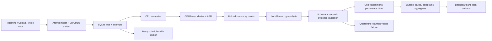
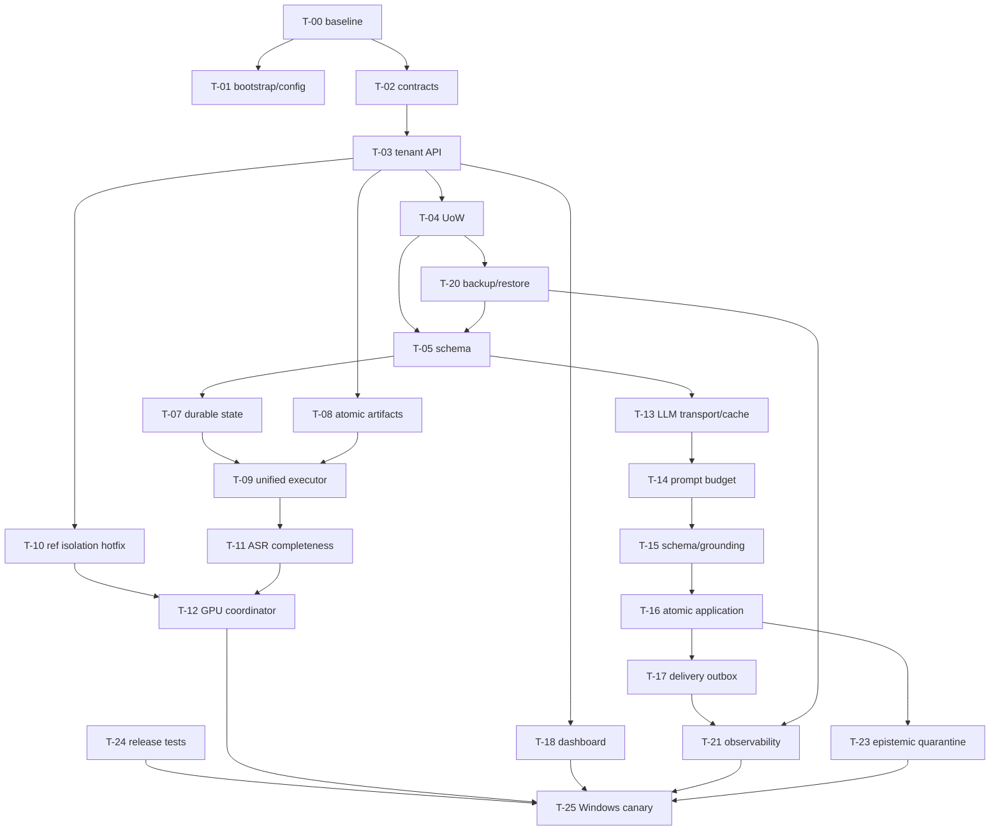

# CallProfiler: доказательная спецификация доведения до production-ready

**Статус:** specification only.  
**Дата аудита:** 2026-08-08. **Ревизия 2 (2026-08-08):** независимая перепроверка утверждений по фактическому коду — см. 16.4. **Ревизия 3 (2026-08-08):** сверка с актуальным `main` `6361c6c` — см. 16.5.  
**Базовая точка:** `main` = `6361c6c`. Первичный аудит выполнен на `742a94c`; между ними 3 коммита, `src/`, `configs/` и `tests/` **не менялись** (diff: `AGENTS.md`, `CONTINUITY.md`, `CHANGELOG.md`, `ARCHITECTURE_SCHEMA.html`, удаление stray-лога), поэтому все code-level выводы §5 действуют дословно. Изменились контрактные документы — это учтено в C-01/C-03/C-05 и R-02.  
**Область:** локальная многопользовательская постобработка звонков на Windows 11, RTX 3060 12 GB, SQLite, GigaAM/Whisper, pyannote, локальный `llama.cpp`, локальный dashboard и опциональная доставка в Telegram.  
**Единственный результат текущей работы:** этот документ. Он не является реализацией, миграцией или разрешением менять `CONSTITUTION.md`.

## 0. Резюме решения

Проект уже существенно больше описанного в `AGENTS.md`: 169 production-модулей Python (около 35 тыс. строк), 132 тестовых файла (около 20,5 тыс. строк), dashboard, graph/biography/insight/psychology и несколько параллельных путей анализа. Он функционально богат, но в текущем виде **не готов к надёжной многопользовательской эксплуатации**.

Стоп-факторы перед production:

1. В batch-диаризации reference embedding первого профиля может применяться к последующим профилям. Это меняет роли `[me]/[s2]` и создаёт межпрофильное семантическое загрязнение.
2. В значительной части mutating API идентификатор строки используется без проверки владельца `user_id`; особенно опасны graph merge и Telegram callback закрытия события.
3. Dashboard хранит выбранный профиль в process-global `_USER_ID`, поэтому две вкладки или параллельные запросы способны читать/изменять данные не того профиля.
4. Pipeline способен удалить нормализованный WAV, а затем считать стадию выполненной; ошибка анализа может быть перезаписана статусом `done`; частично распознанный звонок также считается успешным.
5. SQLite используется через общие соединения с `check_same_thread=False`, с частыми внутренними `commit`, без единого unit-of-work; миграции местами подавляют любые исключения.
6. Нет проверенного backup/restore, согласованного lifecycle фоновых задач, воспроизводимой Windows-установки и исполнимого в текущем checkout тестового окружения.
7. LLM-путь не ограничивает фактический prompt budget, допускает crash парсера на корректном JSON не-объекте, кэширует усечённые ответы и не отделяет синтаксическую валидность от семантической доказательности.
8. Психологический слой выводит «темперамент» и Big Five из слабых прокси без достаточной валидации и затем показывает это как свойства человека. Это риск ложной уверенности, а не production-фича.

Правильное направление — не переписывание в микросервисы, а **модульный локальный монолит с долговечной state machine**, tenant-aware хранилищем, одним GPU-координатором, строгим контрактом LLM-результата, outbox для побочных эффектов и request-scoped профилем в UI. Любые смены ASR/diarization моделей допускаются только после репрезентативного benchmark на целевой Windows-машине.

## 1. Границы, метод и качество доказательств

### 1.1. Что было исследовано

- Полностью прочитаны `CONTINUITY.md`, `CONSTITUTION.md`, последние изменения `CHANGELOG.md`, планы `deepseekdiharea.md` и `opsus5.md`.
- Проинвентаризированы production/test модули, конфигурация, CLI, schema/migrations, pipeline, GPU runners, LLM, bulk, dashboard, delivery, graph, biography, insight и psychology.
- Все 301 Python-файл `src/` и `tests/` успешно прошли AST-разбор с учётом UTF-8 BOM.
- Выполнены точечные динамические проверки parser/bootstrap там, где они не требуют установки зависимостей или записи данных.
- Проверены первичные официальные источники GigaAM, pyannote Community-1 и `llama.cpp` grammar.
- **Ревизия 2 (2026-08-08), исправление собственной ошибки первой редакции.** Первая редакция утверждала, что `pytest`/`ruff` отсутствуют в доступных интерпретаторах и что `.git` отсутствует. Для фактического репозитория это **неверно**: `.git` присутствует с полной историей (`git log` работает, HEAD `742a94c`), а `pytest 8.4.2`, `ruff`, `torch`, `fastapi`, `numpy`, `uvicorn`, `jinja2`, `psutil` импортируются в Python 3.10.11 на dev-машине. Это было свойство урезанного snapshot, а не проекта. E2.
- Настоящий и проверяемый дефект поставки другой: `pyproject.toml` объявляет 13 runtime-зависимостей **без единого version-constraint**, lock-файла нет, а test/dev-группа отсутствует полностью — `pytest` не объявлен нигде. Рабочее окружение существует только как ручное состояние конкретной машины и не воспроизводится на чистой. Заявленные счётчики (`1294 passed/2 skipped`, `CONTINUITY.md`) верны для этой машины, но не являются release evidence. E1.

### 1.2. Шкала доказательств

| Метка | Значение |
|---|---|
| E1 | Непосредственно подтверждено текущим кодом/SQL/конфигом. |
| E2 | Воспроизведено локальным безопасным запуском без изменения репозитория. |
| E3 | Подтверждено первичной документацией проекта/модели. |
| E4 | Инженерный вывод, который требует benchmark/canary на целевой машине. |

### 1.3. Ограничения текущего аудита

- Не запускались GPU-модели, `llama-server`, Telegram и реальная Windows/RTX 3060.
- Полный pytest **на чистой машине** невозможен: test dependencies не объявлены (см. 1.1). На dev-машине они есть как ручное состояние, что и является зафиксированным дефектом поставки, а не доказательством воспроизводимости.
- Не изучались реальные приватные аудиозаписи и рабочая SQLite БД; миграции должны проверяться на обезличенной копии.
- В рамках этой работы не менялись production-код, конфигурация, schema, журналы и Конституция; коммит не создавался.

## 2. Фактическая система и конфликтующие контракты

### 2.1. Реальный data flow

```text
incoming file / dashboard upload / Telegram voice note
  -> filename parse + MD5 + archive copy + calls/contact registration
  -> ffmpeg normalize
  -> pyannote diarization (optional, owner reference)
  -> ASR by diarization turns; fixed windows are used inside/without turns
  -> transcript DB + plaintext export
  -> ASR/pyannote unload
  -> local llama.cpp analysis
  -> analysis + events/promises + graph + aggregates/biography/insight
  -> caller card + Telegram/dashboard
```

В single-call и batch-call путях эта логика частично продублирована и имеет разные failure semantics.

### 2.2. Merge-blocking противоречия, которые должен решить владелец

| ID | Конфликт | Наблюдаемое состояние | Требуемое решение |
|---|---|---|---|
| C-01 | Основной ASR | `CONSTITUTION.md` статьи 3/5/9 называют Whisper primary; `configs/base.yaml`, код и — с `6361c6c` — `AGENTS.md` называют GigaAM primary (Whisper остаётся fallback при `asr_backend: whisper`). Конфликт сузился до «Конституция против всего остального». | Один canonical контракт: зафиксировать GigaAM primary + Whisper fallback ревизией Конституции. Код не «подгонять» молча. |
| C-02 | Размер caller card | Конституция говорит не более 500 символов; код и тесты — 512 UTF-8 bytes. | Выбрать одно проверяемое ограничение. Для Android-файла рекомендуется 512 bytes, но это требует явной ревизии Конституции. |
| C-03 | pyannote: **модель ≠ runtime-библиотека** | Три разных сущности были смешаны. **(a) Модель — решено, вопрос закрыт:** `pyannote/speaker-diarization-3.1` остаётся (решение владельца 2026-08-07 по измеренному DER, `CHANGELOG.md`/`CONTINUITY.md` в `6361c6c`); Community-1 выигрывал 5 из 7 датасетов, проигрывал REPERE, но владелец выбрал «ничего не менять». **(b) Runtime-библиотека — расхождение с реальностью:** фактически установлена `pyannote-audio 4.0.4` + torch 2.6.0+cu124, runner уже на API 4.x (`token=`, распаковка `DiarizeOutput`, `set_telemetry_metrics(False)`, аудио только в память — обход torchcodec). **(c) Документы устарели:** `CONSTITUTION.md` (стр. 305-306) и `AGENTS.md` (дерево модулей + таблица решений) всё ещё называют `3.3.2` и «только `use_auth_token`». | Модельный выбор **не переоткрывать**. Остаётся один технический пункт: ревизией Конституции (и правкой `AGENTS.md`) зафиксировать пару «модель `speaker-diarization-3.1` + runtime `pyannote-audio 4.0.4`», поддерживаемый способ загрузки (`token=` с fallback на `use_auth_token=`), offline/local-ограничения (gated-артефакт, HF-токен, отсутствие сетевой загрузки в production) и владельческий план Б (чистый ECAPA-TDNN вместо `pyannote/embedding`; пересмотр при DER > 15% на собственном корпусе). |
| C-04 | «Полностью локально» и Telegram | Аудио/ASR/LLM локальны, но Telegram отправляет данные наружу. | В privacy contract явно определить Telegram как opt-in transport, какие поля разрешены и что raw transcript/audio не уходит по умолчанию. |
| C-05 | Ветка/релиз | Прямое противоречие двух действующих документов: `AGENTS.md` (`6361c6c`, строки 128 и 183-184) требует все изменения на ветке `claude/clone-callprofiler-repo-hL5dQ` и запрещает пушить в другие ветки; `CLAUDE.md`/`CONTINUITY.md` дают постоянное разрешение владельца коммитить и пушить прямо в `main` («Push to main only. No feature branches», 2026-06-04), и фактические коммиты владельца идут в `main`. | Это **решение владельца, а не вывод спецификации**. Требуется одна однозначная release/branch policy до начала реализации; спецификация не предписывает, какая именно. Что бы ни было выбрано — противоречащий документ правится тем же решением, и релизный gate (T-25) ссылается на выбранную политику, а не на неявное правило. |

Checkpoint **CP-0 (contract freeze)** не пройден, пока C-01…C-05 не решены письменно.

## 3. Проверка `deepseekdiharea.md`

### 3.1. Что подтверждено и полезно

| Тезис | Вердикт | Доказательство/условие |
|---|---|---|
| GigaAM v3 E2E CTC/RNNT умеют punctuation/text normalization | Подтверждено E3 | Официальный GigaAM README. Short `transcribe` ограничен примерно 25 секундами; есть `transcribe_longform`. |
| Word timestamps доступны | Подтверждено E3 | Официальный API содержит `word_timestamps=True`; интеграция в текущий custom AutoModel путь всё равно материальна и требует тестов. |
| Community-1 улучшает ряд DER benchmark и имеет exclusive diarization | Подтверждено E3, **но вопрос закрыт владельцем** | Model card; есть наборы без улучшения/с регрессией → не universal win. Собственный замер владельца (`CHANGELOG.md` 2026-08-07, auto-DER без forgiveness collar): community-1 лучше на AliMeeting 20.3/24.5, CALLHOME 26.7/28.5, DIHARD3 20.2/21.4, AMI IHM 17.0/18.8, MSDWild 22.8/25.4; равно на VoxConverse 11.2; хуже на REPERE 8.9/7.9. **Решение владельца 2026-08-07: «оставить 3.1, ничего не менять».** Пересмотр — только по его же условию (DER > 15% на собственном корпусе). |
| JSON grammar может снизить долю синтаксически невалидного JSON | Подтверждено с оговорками E3/E4 | `llama.cpp` grammar/JSON schema; exact server build и поддерживаемые schema keywords проверяются canary. |
| Нужны acceptance benchmark и измеримое качество | Подтверждено | Это обязательный гейт перед заменой моделей. |

### 3.2. Что неверно, неполно или переоценено

| ID | Тезис плана | Критическая проверка | Решение спецификации |
|---|---|---|---|
| DS-01 | Весь pipeline режет аудио «вслепую» по 25 секунд без VAD | Неверно для успешной диаризации: `_asr_transcribe` получает pyannote turns; GigaAM режет окна внутри turn. Без диаризации fixed windows остаются. | Benchmark трёх стратегий: текущие turns+windows, официальный longform, VAD regions. Не добавлять второй VAD без измерения. |
| DS-02 | VAD-сегменты «почти всегда» короче 25 сек | Не доказано; монологи бывают длиннее. | Любой VAD path обязан дополнительно split длинные сегменты с overlap/merge policy. |
| DS-03 | Пунктуация исправит FTS «склеенные слова» | Причинная связь некорректна: отсутствие пунктуации обычно не удаляет пробелы. | Измерять отдельно readability, semantic extraction и FTS precision/recall. |
| DS-04 | Переход на word timestamps — низкий риск | В текущем коде custom remote model internals; меняются API, alignment и segment assembly. | Отдельный adapter, pinned artifact, golden alignment tests и rollback. |
| DS-05 | Community-1 сам убирает ограничение «ровно 2 speakers» | Model API позволяет диапазон, но текущий код явно задаёт `min_speakers=max_speakers=2` (`pyannote_runner.py:290`). Смена модели этого не меняет — и она в любом случае отклонена владельцем (C-03). | Это **code policy, а не выбор модели**, и она остаётся открытой на текущей 3.1: изменение runner policy + benchmark 1/2/3 speaker и overlap. |
| DS-06 | Grammar гарантирует 100% валидный результат, retry/parser больше не нужны | Overclaim: schema features могут не поддерживаться/быть пропущены; grammar гарантирует лишь язык вывода, не семантику, цитаты и полноту. | Grammar + runtime validator + semantic evidence validator + bounded retry/repair + quarantine. |
| DS-07 | Изменение grammar касается только клиента | Меняются compatibility contract, deployment fingerprint, schema generation, monitoring и fallback. | Canary на exact `llama-server`; cache key включает grammar/schema/build. |
| DS-08 | NeMo можно отвергнуть по широким требованиям Linux/Python/Torch | Утверждение не обосновано первичным источником и не нужно. | NeMo уже вне scope по Конституции; не строить решение на сомнительной справке. |
| DS-09 | Popularity/likes — аргумент production-выбора | Число изменчиво (на дату проверки model card уже показывал иное). | Решают качество на corpus, license, offline packaging, VRAM/latency, не лайки. |

### 3.3. Итог по DeepSeek-плану

План годится как **список исследовательских гипотез**, но не как ready-to-implement backlog. Сначала нужны исправления tenant isolation, state machine, SQLite, backup и LLM semantic validation. Модельные замены идут после baseline corpus; multilingual GigaAM — только при измеренной потребности в других языках.

## 4. Проверка `opsus5.md`

### 4.1. Вердикт по задачам 1–18 и 36

| Задача | Вердикт | Коррекция |
|---|---|---|
| 1, contract `payload`/`what` | Дефект реален | Нужны canonical field, migration/backfill и временный dual-read; бесконечный dual-write запрещён. |
| 2, `run_coro` | Симптом реален, helper опасен | `run_until_complete` нельзя вызывать в уже работающем loop того же thread. Использовать async boundary/outbox worker, а не ambient-loop magic. |
| 3, единые risk thresholds | Полезно | Не смешивать `risk_score` и `bs_score`; policy version/calibration хранить с результатом. |
| 4, unload warnings | Дефект реален | Warning недостаточен: LLM phase не стартует без подтверждённого release/barrier; failure становится retryable error. |
| 5–7, doctor/status/user scope | Направление верно | Нужны два явных режима: scoped `--user` и admin `--all`; исправления гораздо шире указанных методов. |
| 8, удалить dead event bus | Вероятно верно | Низкий приоритет; сначала runtime tracing/grep и contract tests. |
| 9, дешёвый LLM probe | Верно частично | Разделить liveness (`TCP/HTTP`) и readiness (модель/grammar); не делать запрос в constructor. 404 — не model readiness. |
| 10, thread-local SQLite | Недостаточно | Нужны connection factory + UoW + WAL/busy timeout + lifecycle/close + короткие транзакции. Thread-local может протекать в pools. |
| 11, loopback dashboard | Критично | Для local-only режима non-loopback запрещён жёстко. Environment bypass без auth/CSRF неприемлем. |
| 12, caller-card priorities | Идея верна | Предложенные ключи не совпадают с реальными строками; нужен typed renderer, обязательные целые строки, atomic replace. |
| 13, grep/checkpoint | Полезно, недостаточно | Regex не доказывает ownership. Нужны cross-tenant integration/property tests и DB constraints. |
| 14, fused age | UX лучше, но conf=30 произволен | Возраст — диапазон/unknown с provenance; point estimate не показывать без calibrated evidence. |
| 15, `/who` | Допустимая фича после foundation | Переиспользовать scoped search, ambiguity flow и escaping; не blocker. |
| 16, backup | Критично | Использовать SQLite backup API, manifest+SHA-256, atomic publish, `quick_check`, retention и restore rehearsal. |
| 17, grounding audit | Критично, но read-filter мало | Grounding проверяется до записи/публикации; provenance становится schema-level контрактом. |
| 18, sufficiency | Принцип верен | Пороги должны быть data-driven; `insufficient` — нормальный результат. |
| 36, push main | Конфликтует с `AGENTS.md`, но не с «repo policy вообще» — политика противоречива сама себе (C-05) | Релизный checkpoint и owner approval нужны в любом случае; вопрос «ветка или прямой push в `main`» решает владелец в T-02, спецификация его не предрешает. |

### 4.2. Вердикт по задачам 19–35

Задачи образуют большой новый продуктовый слой «психологических сигналов». Реализация до исправления целостности данных создаст точные на вид, но недостоверные показатели.

| Группа | Риск | Решение |
|---|---|---|
| 19–21: turn stats, lexicon, prosody | Словари/stems и overlap имеют высокую вероятность ложных срабатываний; текущие сегменты уже могут быть эксклюзивными/ошибочно размеченными. | Только offline research на размеченном corpus; не писать в основной профиль до quality gate. |
| 22–25: longitudinal/per-contact signals | Относительные percentile при малой выборке создают ярлык даже без абсолютного сигнала. | Minimum sample, uncertainty interval, stability test, abstention. |
| 26: BS v2 | Предложенные веса суммируются в 1.10 и дают ложную точность; прежнее решение проекта откладывало BS v2. | Отдельный product decision + labeled validation; не production backlog сейчас. |
| 27–29: contradictions/debts/source diversity | Часть полезна, но зависит от исправной provenance/identity и atomic events. | После CP-3; facts-first, human confirm для разрушительных выводов. |
| 30: parity split | `call_id` коррелирует со временем/порядком и не даёт независимый split. | Temporal holdout, block bootstrap или repeated time-aware validation. |
| 31: portrait + critic | Та же LLM не является независимым критиком; narrative может усилить ошибочные прокси. | Только evidence-linked report с abstention; human review для первых релизов. |
| 32: change points | z-score на малой автокоррелированной серии и множественные тесты дадут false alarms. | Robust baseline (median/MAD), temporal evaluation, correction for multiple comparisons. |
| 33: RU names | Фиксированный список культурно хрупок и создаёт privacy/identity ошибки. | Candidate + transcript quote + human confirmation; defer. |
| 34: vault export | Удаление `generated/*.md` без ownership manifest опасно. | Manifested atomic export; удалять только файлы, созданные конкретным generation id. |
| 35: metrics | Полезно, но `updated_at-created_at` не равно pipeline latency после поздних обновлений. | Отдельные attempt timestamps/stage durations и SLO от state machine. |

### 4.3. Что `opsus5.md` не обнаружил

Ключевые пропуски: reuse reference embedding между профилями; process-global профиль dashboard; не-scoped repository/graph writes; status `done` после LLM failure; артефакт/stage рассогласование; partial ASR как success; unsafe psychology уже в production UI; глобальная уникальность `ask_log.prompt_hash`; cache reuse между профилями; incomplete purge; FTS rebuild drift; eager import `torch`, из-за которого `doctor` не стартует без ML stack.

## 5. Каталог подтверждённых проблем

Severity: **S0** — риск межпрофильной порчи/потери данных или ложного terminal success; **S1** — production blocker по надёжности/безопасности/восстановлению; **S2** — значимый correctness/operability долг; **S3** — maintainability/UX.

Ниже указаны function-level locations, устойчивые к будущему сдвигу строк. Для воспроизводимости ключевые line anchors текущего snapshot: `orchestrator.py:234,338,451,621,625,705,863`; `watcher.py:206-267`; `pyannote_runner.py:160-172`; `repository.py:115,142,152,477,495,672,1208`; `gigaam_runner.py:111,197,272`; `response_parser.py:30,121`; `llm_client.py:90,144-182`; `dashboard/server.py:27,115-117,418`; `graph/resolver.py:393-572`; `ask.py:42-46`; `card_generator.py:49,228`; `telegram_bot.py:1071`. Line anchors — evidence для audited snapshot, а не стабильный API. Перепроверены на рабочем checkout 2026-08-08 (HEAD `742a94c`) и совпали: `pyannote_runner.py:170` early-return `load`, `repository.py:1208` `update_event_status`, `server.py:27/115-117/418`, `response_parser.py:116-124`, `card_generator.py:49/228`, `resolver.py:393`, `llm_client.py:90`, `ask.py:46`. Крэш парсера на `[]`/`42`/`"text"` воспроизведён (E2).

| ID / sev | Локация | Текущее поведение → ожидаемое | Корневая причина и доказательство | Влияние |
|---|---|---|---|---|
| P-TEN-01 S0 | `pipeline/orchestrator.py:_diarize_batch`; `diarize/pyannote_runner.py:load` | Один runner остаётся загруженным между ref-группами; `load` не заменяет embedding → отдельная загрузка/lease на каждый reference fingerprint. | Group loop не unload; loaded runner early-return. E1. | Чужой голос назначается OWNER, все downstream выводы неверны. |
| P-TEN-02 S0 | `db/repository.py` mutators (`update_call_status`, stage, paths, transcript, analysis, event и др.) | Update/delete по bare ID → ownership guard/tenant key в каждом domain API. | SQL не содержит `user_id`/owner join. E1. | Cross-user mutation при ошибке/crafted ID. |
| P-TEN-03 S0 | `graph/resolver.py:execute_merge`; graph repository | Merge сущностей по ID без user validation → обе сущности и все связи обязаны принадлежать одному profile. | Updates relations/events/entities по IDs. E1. | Разрушительная межпрофильная склейка графа. |
| P-TEN-04 S0 | `deliver/reminders.py:close_item`; `repository.update_event_status` | Telegram callback закрывает event по ID → callback включает signed user/item context и scoped update. | Snooze scoped, close нет. E1. | Пользователь может закрыть чужое событие. |
| P-TEN-05 S0 | `dashboard/server.py:_USER_ID` и `/api/users/select` | Process-global профиль на все запросы → immutable request/session-scoped verified context. | Tests вручную меняют global; SSE тоже global. E1. | Две вкладки смешивают чтения/записи. |
| P-DATA-01 S0 | `pipeline/watcher.py` cleanup; orchestrator resume | При error WAV удаляется, stage остаётся ≥1 и normalization пропускается → stage подтверждается artifact checksum; missing artifact откатывает/rebuild. | Cleanup/state не имеют общего инварианта. E1. | Бесконечный retry loop, необрабатываемый звонок. |
| P-PIPE-01 S0 | `orchestrator._analyze_call` и callers | Analysis exception/default `parse_failed` затем stage 3/4/done → terminal success только после validated mandatory result. | Callee подавляет failure, caller без outcome ставит последующие stages. E1. | Тихая потеря анализа и ложная готовность. |
| P-PIPE-02 S1 | `gigaam_runner.py` window loops | Decode exception пропускает окно; partial/empty transcript принимается → coverage/error threshold и explicit incomplete. | Per-window catch не агрегирует качество. E1. | Смысл звонка теряется без видимой ошибки. |
| P-PIPE-03 S1 | single/batch orchestrator | Два state flow с различными ветками → единый step executor. | Дублированные stage/status transitions. E1. | Регрессии исправляются только в одном пути. |
| P-PIPE-04 S1 | watcher/repository retry | `retry_interval_sec` загружается, но retry происходит немедленно до лимита → persistent `next_retry_at` + backoff/jitter. | Config не участвует в selection. E1. | LLM/GPU outage быстро исчерпывает retry. |
| P-DATA-02 S1 | `ingest/ingester.py` | `copy2` archive не atomic/verified → temp copy, fsync, checksum, atomic replace, затем DB commit/source cleanup. | Нет two-phase artifact protocol. E1. | Partial «original», orphan contacts/files. |
| P-DATA-03 S1 | `transcribe/text_export.py` | Имя по source stem в общем каталоге, direct write → profile/call-specific path + atomic replace. | Tenant/call identity отсутствует в path. E1. | Перезапись transcript другого профиля/одноимённого файла. |
| P-TEN-06 S1 | `repository.add_user`; path construction | `user_id` не валидируется как path segment → canonical restricted ID, resolved-path containment. | User input входит в `data/users/{user_id}`. E1. | Traversal/коллизии путей. |
| P-DB-01 S0 | `db/repository.py:_migrate` | `except Exception: pass` скрывает drift → versioned transactional migration fail-fast. | Безусловное подавление. E1. | Код работает поверх неизвестной schema. |
| P-DB-02 S1 | Repository/dashboard connections | Shared conn + `check_same_thread=False` + internal commits → connection/UoW ownership и explicit transaction. | Нет concurrency contract. E1. | `database locked`, partial commit, races. |
| P-DB-03 S1 | `schema.sql`, graph/biography schema | Child IDs/user_id не гарантируют одного owner → composite FK/trigger/owner join. | Tenant — только convention. E1. | SQLite не блокирует cross-tenant rows. |
| P-DB-04 S1 | `repository.purge_user` | Hardcoded список не покрывает новые таблицы → declarative ownership manifest/FK cascade test. | Покрыты calls/transcripts/analyses/events/promises/contact_summaries/contacts + graph + `bio_*`; **не покрыта ни одна из 16 таблиц `insight/repository.py`** (`contact_features`, `contact_archetypes`, `contact_age_estimates`, `contact_age_style`, `contact_notes`, `owner_mirror`, `fact_feedback`, `reminders`, `report_state`, `deep_facts`, `deep_scans`, `mention_edges`, `insight_reports`, `promise_outcomes`, `entity_contact_map`, `contact_tiers`) и `llm_calls`/`ask_log`. Schema эволюционировала быстрее purge. E1. | Privacy delete неполон: производные профили/цитаты/кэш LLM переживают удаление пользователя. Отдельно опасен `reminders` — тикер F2 продолжает слать Telegram-напоминания по уже удалённому профилю. |
| P-DB-05 S1 | events/promises/bulk saves | Retry append без deterministic identity; batch commits частями → idempotency key + one UoW/outbox. | Несколько внутренних commit. E1. | Дубли, graph не соответствует analysis. |
| P-DB-06 S1 | FTS schema/migration | External-content FTS объявляет `user_id`, которого нет в content; rebuild отмечен как проблемный → tenant-safe FTS contract и tested rebuild. | Schema drift. E1. | Rebuild/поиск ненадёжны. |
| P-LLM-01 S1 | `analyze/llm_client.py:__init__` | Каждый object делает реальный completion «test» → lazy reusable client, separate liveness/readiness. | Side effect в constructor. E1. | Лишняя latency/load; cold/offline path ломается. |
| P-LLM-02 S1 | AnalysisService/bulk + `prompt_budget.py` | Clipper существует, но основной transcript не ограничивается; duration=0 → deterministic budget + truthful metadata. | Dead integration. E1. | Context overflow/truncation/дорогой retry. |
| P-LLM-03 S0 | `response_parser.py` | Корректные JSON `[]`, `"text"`, `42` приводят к `.keys` crash; проверяются лишь 4 fields → typed full schema before access. | Parser смешивает syntax и domain model. E1/E2. | Pipeline crash/ложный repaired success. |
| P-LLM-04 S1 | `configs/prompts/analyze_v001.txt` | Owner захардкожен как Сергей Медведев → per-user owner identity/aliases or neutral roles. | Prompt global, profile metadata не подставляется. E1. | Неверная атрибуция для других пользователей. |
| P-LLM-05 S1 | main analyze prompt | Transcript/prior summaries вставляются как instructions → delimiters, data-only envelope, injection regression corpus. | Нет untrusted-content contract. E1. | Запись диктует модели output/prompt. |
| P-LLM-06 S1 | LLM cache/`ask_log` | Cache key не tenant/model-artifact-complete; truncated output кэшируется; `ask_log.prompt_hash` UNIQUE глобально → scoped composite keys, cache only validated complete. | Глобальная идентичность и неполный fingerprint. E1. | Межпрофильный reuse, stale output, второй профиль теряет cache row. |
| P-LLM-07 S1 | response/persistence/derived layers | Валидный JSON считается истинным; quotes/provenance не обязательны schema-level → semantic grounding gate. | Нет distinction syntax/meaning/evidence. E1/E3. | Уверенные выдуманные факты. |
| P-BULK-01 S1 | `bulk/enricher.py` | Дублирует analysis path, не clip, UNKNOWN→OTHER, multiple commits, финальный summary-rebuild работает по уже очищенному batch → единый application service. | Параллельная реализация контракта. Периодический flush делает `pending_batch.clear()`, а блок «batch summary rebuild» в конце итерирует именно `pending_batch` → перестраиваются сводки только для контактов последнего неполного чанка. Ветка `KeyboardInterrupt` пишет анализы, но пропускает `_update_graph`. E1. | Разные результаты online/bulk, partial persistence; после bulk-прогона большинство `contact_summaries` (risk/обещания/совет) молча остаются устаревшими, граф расходится с analyses. |
| P-GPU-01 S1 | `_unload_models` | Ошибка unload подавлялась/логируется, но LLM может стартовать → GPU barrier и fail phase. | Нет resource state machine. E1. | OOM, нарушение Конституции. |
| P-MODEL-01 S1 | GigaAM/pyannote load | `trust_remote_code`, local artifact без checksum/revision manifest → allowlisted immutable model manifest. | Supply/runtime fingerprint отсутствует. E1. | Невоспроизводимый/изменённый код модели. |
| P-MODEL-02 S1 | diarization roles | Nearest embedding всегда даёт роль; `role_fragile` смотрит в основном UNKNOWN share → confidence/margin/coverage contract, abstain. | Forced decision без calibration. E1. | Уверенно перепутанные роли. |
| P-WEB-01 S0 | dashboard bind/mutations | Remote bind возможен, auth/CSRF нет → local-only hard loopback + origin/CSRF defense. | «Локальный» принят как security boundary без enforcement. E1. | Любой в сети/браузер может мутировать данные. |
| P-WEB-02 S1 | dashboard upload | Полный `request.body()` до size guard; предел 512 MB → streaming bounded upload/temp + atomic import. | Check после allocation. E1. | Memory exhaustion/collision. |
| P-WEB-03 S2 | async routes/poller/readers | Sync SQLite/CPU work в loop; task не хранится/cancel; connections не закрываются → lifespan + executor/bounded queue + close. | Lifecycle implicit. E1. | Hang, leaks, shutdown corruption. |
| P-OPS-01 S0 | repository-wide | Нет backup/restore/restore drill → verified local backup pipeline. | Recovery не спроектировано. E1. | Одна DB corruption = потеря системы. |
| P-OPS-02 S1 | packaging/config/start scripts | Unpinned dependencies, incomplete GigaAM manifest, hardcoded Python paths; tests unavailable → reproducible Windows bundle/lock. | Installation treated as manual state. E1/E2. | Нельзя повторить рабочую среду. |
| P-OPS-03 S1 | package `__init__.py`, doctor | Import package eagerly requires/patches torch → lightweight CLI/doctor bootstrap без ML imports. | Global side effect при import. E2. | Doctor не диагностирует отсутствие ML stack — сам падает. |
| P-OPS-04 S2 | doctor/status | Global и per-user checks смешаны, одни результаты рассылаются всем → explicit scoped/admin reports. | Нет audience contract. E1. | Утечка метаданных/ложный диагноз профиля. |
| P-OPS-05 S1 | config loader | Проверяется малая часть контрактов; empty YAML crash; URLs/path/ranges не валидируются → typed exhaustive startup validation. | Config dataclass без semantic validation. E1. | Поздние ошибки/unsafe bind/path collision. |
| P-OBS-01 S1 | pipeline/system | Нет durable attempts/stage latency/correlation; Telegram логирует prefix token → structured redacted telemetry. | Логи не являются state evidence. E1. | Нельзя доказать SLO/причину; secret fragment в log. |
| P-CARD-01 S2 | `card_generator.py`, Constitution | Blind byte truncation режет строку; 512 bytes vs 500 chars → typed priority renderer и единый policy. | Текст сначала собирается, затем режется. E1. | Повреждённая карточка/несоответствие contract. |
| P-POL-01 S2 | summary/dashboard/card | Risk/BS thresholds дублируются → versioned policy object. | UI/domain logic разошлись. E1. | Один звонок выглядит по-разному. |
| P-EPI-01 S1 | `psychology_profiler.py`, prompts/dashboard | Big Five/классический темперамент вычисляются из frequency/risk proxies и показываются как trait → quarantine/remove or research-only with abstention. | Слабые прокси превращены в психометрику. E1. | Эпистемический и репутационный вред. |
| P-EPI-02 S1 | graph/biography/profile | Derived facts/quotes не имеют обязательного provenance tuple → evidence ledger. | Provenance optional/ad hoc. E1. | Невозможно проверить/исправить источник. |
| P-CLI-01 S2 | `cli/main.py`, command modules | Parser регистрируется двумя способами, main монолитен, partial failures часто exit 0 → один registry + typed exit codes. | Эволюция оставила legacy path. E1. | CLI docs/behavior drift; автоматизация не видит failure. |
| P-NFR-01 S1 | tests/repository | Нет обязательного gold audio corpus/quality budget/fault tests/Windows gate → layered release gates. | Unit count принят за production evidence. E1/E2. | Модельная/операционная регрессия проходит незамеченной. |

## 6. Целевая production-ready архитектура

### 6.1. Выбор

**Модульный монолит, два локальных процесса и один SQLite database:**

- `callprofiler-worker`: watcher/ingest, durable jobs, CPU normalization, единственный GPU coordinator, LLM phase, materialization/outbox.
- `callprofiler-ui`: loopback-only dashboard API/static; никаких GPU imports; только tenant-scoped application services.
- Опциональный Telegram adapter может жить в worker, но получает только outbox messages, разрешённые privacy policy.
- CLI — thin client/application entry points; `doctor` и backup не импортируют torch/transformers.

Микросервисы, Redis, PostgreSQL, Docker и cloud inference не нужны и запрещены текущей Конституцией. Разделение на два процесса даёт lifecycle/security isolation без смены стека.

### 6.2. Runtime flow и инварианты



Непереговорные инварианты:

1. В каждом domain command есть `UserId`; bare row ID недостаточен. Admin cross-user operations имеют отдельное имя, capability и audit.
2. `DONE` означает завершение обязательного core (`archive`, normalized artifact, validated transcript, validated analysis, atomic persistence). Опциональная доставка имеет отдельный статус и не переписывает core.
3. Stage не существует без проверяемого artifact/state record; artifact checksum/path/generation принадлежат call+user.
4. Один GPU lease. ASR/diarization и LLM не резидентны одновременно. Failed unload блокирует LLM и переводит attempt в retryable failure.
5. Результат LLM не равен факту. Сначала syntax/schema, затем domain ranges/completeness, затем evidence/provenance; иначе quarantine.
6. Каждый шаг идемпотентен по `(user_id, call_id, step, input_fingerprint, implementation_version)`.
7. Оригинал публикуется только atomic+verified; не изменяется и не удаляется до durable registration.
8. Dashboard profile immutable на request; server process не имеет «текущего пользователя».
9. SQLite transaction boundary задаёт application service/UoW, а не произвольный repository method.
10. Любая derived запись хранит source lineage и version; неизвестность/недостаточность — корректный результат.

### 6.3. Durable state model

Рекомендуемые состояния core job:

```text
DISCOVERED -> ARCHIVED -> NORMALIZED -> TRANSCRIBED -> ANALYZED -> MATERIALIZED -> DONE
                  \             \              \
                   -> RETRYABLE_FAILED(next_retry_at, reason, attempt)
                   -> QUARANTINED(non-retryable/data-quality)
                   -> CANCELLED(explicit operator action)
```

`delivery_jobs`/outbox живут отдельно: `PENDING -> SENT | RETRYABLE_FAILED | UNKNOWN | DEAD_LETTER`. `UNKNOWN` — исход внешней отправки, о котором нельзя судить локально (обрыв после принятия запроса); он не ретраится автоматически и требует владельческой политики, см. T-17. Старый integer `pipeline_stage` временно остаётся compatibility projection, но перестаёт быть источником истины.

Минимальные новые logical records (конкретный DDL проектируется в задаче T-05):

- `processing_jobs` — required target state, lease owner/expiry, `next_retry_at`, terminal reason.
- `processing_attempts` — start/end, stage, error class, retryable, artifact/model/prompt fingerprints, duration.
- `artifacts` — owner/call/kind/generation/path/hash/size/status.
- `analysis_runs` — input/prompt/model/schema fingerprints, validation state, raw response retention policy.
- `evidence_refs` — source call/segment/time range/exact quote+hash and derived item.
- `outbox` — deterministic event key, payload class, privacy level, delivery status.
- `schema_migrations` — ordered version/checksum/applied_at.

### 6.4. Tenant-aware persistence

- Value objects `UserId`, `CallId`, `ContactId`; public methods выглядят как `update_call(UserId, CallId, ...)`.
- SQL updates используют owner predicate or parent join; `rowcount == 1` является postcondition.
- Child tables с прямым tenant access получают `user_id`; composite unique/FK или triggers запрещают mismatched owners.
- Connection factory: одна connection на UoW/request/worker operation, `foreign_keys=ON`, `busy_timeout`, WAL после проверки, deterministic close.
- Read-only dashboard connections и один bounded writer path; долгие ML операции никогда не держат DB transaction.
- Versioned migrations атомарны, имеют preflight/postflight и не подавляют ошибки.
- Purge/backup/restore/FTS rebuild проходят schema inventory test; появление новой tenant-owned table ломает CI до обновления ownership manifest.

### 6.5. GPU, ASR и diarization

- `GpuCoordinator` выдаёт exclusive lease и знает resident model fingerprint/ref fingerprint.
- Ref embedding — artifact конкретного `user_id`; смена ref означает unload/reload или безопасную explicit `set_reference` с тестируемым postcondition.
- ASR runner возвращает не только segments, но coverage, failed regions, duration, model revision, language confidence и completeness status.
- Роль назначается только выше calibrated similarity/margin/coverage; иначе `UNKNOWN`, и анализ не делает owner-specific assertions.
- Model registry принимает только allowlisted local directory + hash manifest; remote download/`trust_remote_code` в production startup выключен либо привязан к заранее проверенному immutable snapshot.
- Candidate ASR model/segmentation не заменяет stable path без corpus gate из R-01. Диаризационная модель зафиксирована решением владельца (C-03) — её замена не является инженерным решением этого плана; R-02 калибрует политику ролей на действующей модели.

### 6.6. LLM contract

Порядок: deterministic prompt budget → untrusted data envelope → exact prompt/model/schema fingerprints → constrained decoding when supported → JSON decode → full typed schema → semantic validation → evidence grounding → persistence.

Кэшируется только `VALIDATED_COMPLETE`; ключ включает `user_id` (privacy isolation), normalized input hash, prompt bytes hash/version, JSON schema+grammar hash, model artifact/build, generation parameters и validator version. `truncated`, `parse_failed`, `schema_failed`, `ungrounded` не кэшируются как успех.

Grammar остаётся оптимизацией syntax reliability. Обязательный fallback: bounded retry с corrective message на transport/schema failures; semantic failures не «ремонтируются» догадкой parser и уходят в quarantine/reanalysis.

### 6.7. Dashboard и external delivery

- Только `127.0.0.1`/`::1`; remote bind — startup error. Если когда-либо нужен remote mode, это отдельный threat model с auth/TLS/CSRF, а не env flag.
- `user_id` передаётся в path/session, проверяется один раз dependency/middleware и далее как immutable context.
- Mutations используют origin/CSRF token даже на loopback, optimistic version/idempotency key и audit event.
- SSE/WebSocket channel partitioned by user/session; payload никогда не зависит от global state.
- Upload streaming, размер/расширение/MIME проверяются до materialization; temp -> hash -> atomic ingest.
- Telegram callback содержит signed owner+entity+action+expiry; handler повторно проверяет allowlist и ownership. В outbox не помещается raw audio/transcript без явной policy.

### 6.8. Recovery, наблюдаемость и SLO

- Backup через SQLite online backup API: snapshot -> `quick_check`/open -> manifest SHA-256/schema version -> atomic publish -> retention. Ежеквартальный scripted restore rehearsal на отдельном temp path.
- Structured logs: `run_id`, `attempt_id`, hashed/redacted `user_id`, `call_id`, stage, model fingerprint, duration, outcome; token/quote/audio path не логируются по умолчанию.
- Metrics считаются по attempt timestamps, не по mutable `calls.updated_at`.
- Начальные SLO после измерения baseline: 0 cross-tenant violations; 0 silent terminal success; 100% backup verification; ≥99% idempotent replay equivalence; latency/quality thresholds фиксируются только после Windows benchmark.

## 7. Исполнимый backlog атомарных задач

### 7.1. Правила исполнения backlog

- Каждая задача ниже — отдельный reviewable vertical slice. Поля **Goal / Why / Scope / Output / Files / Approach / Alternatives / Dependencies / Risks / Tests / Acceptance / Rollback / Trace** обязательны и не могут исчезнуть при переносе в issue tracker.
- Имена файлов — ожидаемая область, а не разрешение менять всё перечисленное. Точный diff утверждается на старте задачи.
- После каждого нетривиального изменения запускается targeted suite; на checkpoint — полный suite, migration tests и Windows smoke.
- Schema/Constitution changes оформляются отдельными owner-approved решениями. Никакая задача ниже не разрешает автоматически менять merge-blocking правила.
- Сначала correctness/recovery; исследовательские и психологические фичи не могут занять GPU/engineering budget до CP-5.

### T-00 — Воспроизводимый baseline и release evidence bundle (P0)

- **Goal:** зафиксировать исполнимый baseline до первой правки.
- **Why:** `pyproject.toml` не содержит ни одного version-constraint и не объявляет test/dev-зависимости (`pytest` отсутствует в манифесте), lock-файла нет. Окружение существует как ручное состояние конкретной машины: счётчики тестов из `CONTINUITY.md` воспроизводимы только на ней и не являются release evidence. (Ревизия 2: обоснование исправлено — прежняя формулировка «`pytest`/`ruff` недоступны, `.git` отсутствует» относилась к урезанному snapshot и для репозитория ложна; сама задача остаётся P0.)
- **Scope:** только tooling/docs/test runner и обезличенный inventory; без functional change.
- **Output:** Windows-compatible test command, dependency snapshot, machine/model/config fingerprints, full test/ruff result, known-fail ledger.
- **Files:** `pyproject.toml` или отдельный pinned requirements/lock, CI/local scripts, test docs; не production pipeline.
- **Approach:** определить supported Python; создать hash-pinned dev/runtime manifests; bootstrap в чистом каталоге; сохранить machine-readable report.
- **Alternatives:** `pip-tools` lock, `uv` lock или локальный wheelhouse; выбрать один после проверки Windows/system-Python policy. Ручной `pip install` без lock отвергнут.
- **Dependencies:** CP-0 решение о Python/install policy.
- **Risks:** CUDA wheels платформозависимы; lock одного OS нельзя выдавать за универсальный.
- **Tests:** clean-machine install; `python -m callprofiler --help`; AST; full `pytest`; `ruff`; import smoke без GPU.
- **Acceptance:** один документированный command воспроизводит окружение и полный suite на целевой Windows; report содержит версии/hashes и exit code 0 либо явно утверждённый baseline failure.
- **Rollback:** удалить новый tooling manifest/script; runtime данные не затрагиваются.
- **Trace:** P-OPS-02, P-NFR-01.

### T-01 — Lightweight bootstrap и typed config preflight (P0)

- **Goal:** `doctor`, `--help`, backup и config validation запускаются без torch/model imports.
- **Why:** сейчас package import требует torch и глобально monkey-patch `torch.load`; doctor не может диагностировать отсутствующий ML stack.
- **Scope:** import graph и config validation; не менять ASR behaviour.
- **Output:** side-effect-free package init, lazy command imports, `ConfigValidationReport` с errors/warnings.
- **Files:** `src/callprofiler/__init__.py`, `cli/main.py`, `config.py`, `doctor.py`, startup scripts, tests.
- **Approach:** перенести ML imports внутрь runner factory; monkey-patch максимально сузить context; валидировать empty YAML, URL loopback, dirs, executables, numeric ranges, path containment/collisions, backend-specific secrets/dependencies.
- **Alternatives:** отдельный minimal `doctor` executable; допустим временно, но единый lazy CLI предпочтительнее.
- **Dependencies:** T-00.
- **Risks:** circular imports и изменённый timing monkey-patch для legacy pyannote.
- **Tests:** subprocess imports with fake/no torch; empty/malformed config table tests; ffmpeg+ffprobe discovery; unsafe host/path rejection; backend contract matrix.
- **Acceptance:** `python -m callprofiler doctor` выдаёт полезный report без ML packages; production command lazy-loads нужный backend; no import-time network/GPU/global patch.
- **Rollback:** вернуть command-level import adapter; старый model runner API сохраняется за facade.
- **Trace:** P-OPS-03, P-OPS-05, C-01/C-03.

### T-02 — Canonical domain/privacy contracts и Constitution decision records (P0)

- **Goal:** снять C-01…C-05 до кодовых миграций.
- **Why:** реализация не может одновременно удовлетворять противоречащим ограничениям.
- **Scope:** owner decisions: primary/fallback ASR, **runtime-контракт pyannote** (модельный выбор уже сделан 2026-08-07 — фиксируется, а не переоткрывается: C-03), card limit, Telegram privacy, branch/release, definition of `done`.
- **Output:** 5 коротких measured decision records; при одобрении владельца — отдельная Constitution revision.
- **Files:** `CONSTITUTION.md`, architecture/decision docs, config defaults — только в будущей implementation session и отдельным commit.
- **Approach:** для каждого конфликта привести observed evidence, choice, compatibility, migration, rollback; запретить silent drift.
- **Alternatives:** временно freeze current behavior и маркировать конфликт startup warning; это допустимо до измерения, но не для release.
- **Dependencies:** T-00; R-01 нужен для окончательного ASR-решения, но не для определения процесса выбора. Диаризационная модель уже решена владельцем — T-02 её фиксирует, а не выбирает.
- **Risks:** широкая ревизия Конституции может скрыть unrelated weakening.
- **Tests:** contract tests, сверяющие default config, CLI help и selected runner/policy; docs lint.
- **Acceptance:** каждый conflict имеет одного owner, одно решение и дату review; config/code/tests ссылаются на тот же policy version.
- **Rollback:** revert отдельного decision commit; не смешивать с functional diff.
- **Trace:** C-01…C-05, P-CARD-01, P-MODEL-01.

### T-03 — Tenant identity и ownership API (P0)

- **Goal:** невозможность mutating/read command без explicit tenant context.
- **Why:** bare IDs допускают cross-user операции и path traversal.
- **Scope:** value objects, `user_id` validation, repository/application signatures; admin path отдельно.
- **Output:** `UserId` canonicalizer, ownership-check helpers, scoped APIs, explicit `AdminScope` capability.
- **Files:** `models.py`/new domain identity module, `db/repository.py`, graph/biography repos, CLI/dashboard/Telegram callers, tests.
- **Approach:** allowlist slug (`[A-Za-z0-9][A-Za-z0-9_-]{0,N}` or documented Unicode policy), resolved-path containment; `(user_id,id)` parameters; SQL owner predicate/join; assert rowcount.
- **Alternatives:** context-local implicit user отвергнут — плохо виден и повторяет dashboard global; composite typed key предпочтителен.
- **Dependencies:** T-00, T-02.
- **Risks:** массовое изменение signatures; legacy IDs с недопустимыми символами потребуют mapping migration.
- **Tests:** two-user table-driven attack tests for every mutator/read; random IDs; traversal strings; wrong-owner returns `NotFound` without information leak; admin operations separately authorized/audited.
- **Acceptance:** static inventory не содержит public mutator с bare tenant-owned ID; cross-tenant suite показывает 0 mutations/reads; paths всегда под user root.
- **Rollback:** compatibility adapter только с explicit user; запрещён adapter, угадывающий profile.
- **Trace:** P-TEN-02/03/04/06, P-DB-03, P-EPI-02.

### T-04 — SQLite connection factory и Unit of Work (P0)

- **Goal:** детерминированная concurrency/transaction semantics.
- **Why:** общий `check_same_thread=False` connection и вложенные commits создают partial state/locks.
- **Scope:** connection lifecycle, pragmas, UoW boundary; без schema redesign.
- **Output:** `ConnectionFactory`, read-only/read-write UoW, transaction policy, bounded writer behavior.
- **Files:** `db/repository.py` split/facade, dashboard reader, biography/graph repositories, tests.
- **Approach:** connection per request/job UoW; `foreign_keys=ON`, measured WAL, `busy_timeout`; repository methods не commit; application service commits/rollbacks; close in context manager/lifespan.
- **Уже существующее состояние (не переоткрывать):** `repository._get_conn` уже ставит `journal_mode=WAL` и `foreign_keys=ON`, а reader дашборда уже ставит `query_only=ON` + `busy_timeout=3000`. **WAL является load-bearing:** read-only коннект `?mode=ro` не видит WAL-записи, из-за чего дашборд показывал замороженные данные (`bugs.md` 2026-06-04); в `doctor.py` на это стоит отдельный чек `db-wal`. Отключение/смена journal mode = регресс исправленного бага. Реальный пробел этой задачи — отсутствие `busy_timeout` на **writer**-коннекте и отсутствие UoW/lifecycle, а не включение WAL.
- **Alternatives:** thread-local connection отклонён как конечное решение из-за thread-pool lifecycle/leak; actor-style single writer допустим поверх factory при measured contention.
- **Dependencies:** T-00, T-03.
- **Risks:** long-lived transactions around ML work; запретить architectural test.
- **Tests:** rollback of multi-repository use case; concurrent readers/writers; forced lock timeout; connection leak count; no commit in repository method.
- **Acceptance:** failure в середине UoW leaves zero partial rows; 100 concurrent bounded operations без cross-thread error/data loss; all contexts close.
- **Rollback:** repository facade can route to old calls behind feature flag only during migration; no dual commit.
- **Trace:** P-DB-02, P-DB-05, P-WEB-03.

### T-05 — Versioned schema, owner constraints и FTS rebuild (P0)

- **Goal:** сделать tenant integrity и schema evolution enforceable самой БД.
- **Why:** convention-only `user_id`, silent migrations и broken FTS rebuild — S0/S1.
- **Scope:** migration framework; composite ownership constraints/triggers; statuses/checks; FTS; никаких продуктовых columns вне нужного.
- **Output:** ordered checksum migrations, schema ownership manifest, pre/postflight, tenant-safe FTS and rebuild command.
- **Files:** `db/schema.sql`, migration modules, repository bootstrap, graph/biography schema, tests/fixtures.
- **Approach:** expand-only migration; backfill user from parent; detect mismatches before constraints; composite unique parents/FKs or triggers; transactional migration; `user_version`/ledger checksum; FTS external content aligned or contentless design with explicit sync.
- **Alternatives:** только application guards недостаточны; triggers могут быть применены там, где SQLite composite FK требует intrusive table rebuild.
- **Dependencies:** T-03, T-04, verified backup prototype T-20 before production data migration.
- **Risks:** table rebuild, FTS downtime, legacy orphan/mismatch.
- **Tests:** migrate copies from every known schema fixture; injected cross-user rows fail; rollback on corrupt legacy row; FTS create/update/delete/rebuild parity; migration idempotency/checksum tamper.
- **Acceptance:** `foreign_key_check`/`quick_check` clean; cross-user inserts/updates rejected; search results identical before/after rebuild; migration failure loud and atomic.
- **Rollback:** pre-migration verified backup + version-specific reverse/copy restore; no in-place destructive retry.
- **Trace:** P-DB-01/03/06, P-TEN-02/03, P-EPI-02.

### T-06 — Полный purge/delete ownership manifest (P0)

- **Goal:** гарантированное удаление ровно одного профиля и его файлов.
- **Why:** hardcoded purge не знает новых tables; file artifacts не имеют manifest.
- **Scope:** tenant-owned DB tables, FTS, cards/transcripts/derived exports; originals удаляются только explicit destructive command. Явно включить 16 таблиц `insight/repository.py`, `llm_calls`/`ask_log` и `reminders` (последний — иначе удалённый профиль продолжает слать Telegram, см. P-DB-04).
- **Output:** declarative ownership registry, dry-run plan, transactional DB purge, manifested file quarantine/trash.
- **Files:** repository/admin purge service, artifact registry, CLI, tests.
- **Approach:** schema introspection test requires ownership rule for every table; count preview; FK-safe order/cascade; path containment; move files to recoverable quarantine before final deletion.
- **Alternatives:** generic `DELETE WHERE user_id` невозможен для child tables без column; pure cascades полезны после T-05, но external files всё равно требуют manifest.
- **Dependencies:** T-03/T-05; T-20 backup.
- **Risks:** необратимая потеря данных и accidental broad path deletion.
- **Tests:** synthetic profile populates every owned table/artifact; purge one of two users; other byte-for-byte DB logical snapshot unchanged; traversal/symlink rejection; interrupted purge resume.
- **Acceptance:** dry-run counts match actual; zero orphan/owned rows/files; recovery window documented; no recursive delete on unresolved/global path.
- **Rollback:** restore DB backup + move quarantined files back within retention window.
- **Trace:** P-DB-04, P-TEN-06, opsus task 34 risk.

### T-07 — Durable jobs, attempts, retry/backoff и artifact reconciliation (P0)

- **Goal:** заменить integer-stage-as-truth на recoverable state machine.
- **Why:** missing WAV при stage≥1, immediate retries и status overwrite создают silent loss/loops.
- **Scope:** job/attempt/artifact records, state transitions, retry scheduler; compatibility projection old fields.
- **Output:** transition table, lease/heartbeat, `next_retry_at`, error taxonomy, startup reconciler.
- **Files:** new pipeline state modules, repository/schema migration, watcher/orchestrator adapters, tests.
- **Approach:** compare-and-set legal transition; persist attempt before work and outcome after; input/output fingerprint; exponential backoff+jitter; reconcile artifact existence/hash and stale lease; required vs optional stages.
- **Alternatives:** продолжить добавлять `pipeline_stage` conditions отвергнуто как не composable; external queue запрещена/не нужна.
- **Dependencies:** T-04/T-05; T-20 before production migration.
- **Risks:** dual source of truth during rollout.
- **Tests:** transition property tests; crash at every boundary; missing/corrupt artifact; clock/backoff; two workers lease same call; replay convergence; legacy stage import.
- **Acceptance:** любой injected crash после restart приводит либо к one valid completion, либо visible quarantine; no tight retry; `DONE` impossible without required validated artifacts.
- **Rollback:** retain old stage projection and read-only compatibility; restore DB backup, disable new scheduler—not erase attempts.
- **Trace:** P-DATA-01, P-PIPE-01/03/04, P-OBS-01.

### T-08 — Atomic ingest, original archive и tenant-safe exports (P0)

- **Goal:** оригиналы и производные файлы публикуются атомарно, адресуются owner+call.
- **Why:** `copy2` и stem-only direct write допускают partial/overwrite.
- **Scope:** incoming→archive, normalized/transcript/card export helper; не менять content algorithms.
- **Output:** common `ArtifactStore` with temp/fsync/hash/atomic replace, deterministic paths and generations.
- **Files:** `ingest/ingester.py`, `transcribe/text_export.py`, normalizer output, card writer, artifact DB integration, tests.
- **Approach:** allocate under same filesystem; stream hash while copy; verify source MD5/size; fsync file+directory where supported; replace; register in UoW; cleanup only owned temp generations.
- **Alternatives:** database blobs rejected for large audio; filenames with only phone/stem rejected due collisions.
- **Dependencies:** T-03/T-07.
- **Risks:** Windows replace/fsync semantics, antivirus locks, path length.
- **Tests:** same filename/two users; process interruption; disk full; source mutation mid-copy; symlink/path traversal; Windows path tests; immutability test.
- **Acceptance:** never visible partial artifact; originals hash-stable; concurrent same-name ingests distinct/idempotent; stage reconciler validates hashes.
- **Rollback:** old path readable via compatibility locator; new writes disabled, no originals removed.
- **Trace:** P-DATA-02/03, P-TEN-06, P-CARD-01.

### T-09 — Единый pipeline step executor для single/batch/bulk (P0)

- **Goal:** один набор state transitions и failure semantics для всех ingress modes.
- **Why:** single/batch/bulk расходятся и подавляют ошибки.
- **Scope:** orchestration application layer; runners remain adapters.
- **Output:** `ProcessCall` step graph/executor, batch scheduler as batching optimization only, typed `StepOutcome`.
- **Files:** `pipeline/orchestrator.py`, watcher, bulk loader/enricher, voice-note/import callers, tests.
- **Approach:** pure step selection from state; batch groups compatible steps/resources but delegates same executor; exceptions classify retryable/fatal; no callee sets final status secretly.
- **Alternatives:** поддерживать два flows с shared helpers недостаточно — transition ownership всё равно раздвоено.
- **Dependencies:** T-07/T-08.
- **Risks:** performance regression и temporary feature mismatch.
- **Tests:** same call through single/batch/bulk yields equivalent logical DB/artifacts; injected failure matrix; note/no-analysis policy; optional delivery failure.
- **Acceptance:** only one code owner mutates core states; no path marks done after failed validation; replay equivalence ≥99%/all deterministic fixtures.
- **Rollback:** feature flag routes scheduler to legacy orchestrator while preserving new job records; no schema rollback required.
- **Trace:** P-PIPE-01/03, P-BULK-01.

### T-10 — Multi-profile diarization resource isolation (P0 hotfix slice)

- **Goal:** ref embedding никогда не переиспользуется между профилями.
- **Why:** P-TEN-01 directly corrupts roles and downstream facts.
- **Scope:** grouping/load/unload/reference fingerprint only; no model replacement.
- **Output:** runner contract exposes loaded model/ref fingerprint; group boundary enforces correct state.
- **Files:** `pipeline/orchestrator.py`, `diarize/pyannote_runner.py`, focused tests.
- **Approach:** stable group by exact model+ref artifact hash; before each group verify fingerprint, otherwise unload/load; empty/missing refs explicit `UNKNOWN`; prevent parallel ref mutation.
- **Alternatives:** runner per user increases VRAM and forbidden residency; dynamic embedding setter is acceptable only if pyannote model remains and setter postcondition is tested.
- **Dependencies:** T-03; can ship before T-09 as narrowly scoped S0 fix, then port to coordinator.
- **Risks:** extra load latency, unload failure.
- **Tests:** two synthetic users/ref embeddings in both orders; spy proves second reference used; missing ref; same ref dedup; unload failure blocks group; no transcript cross-contamination.
- **Acceptance:** role output changes with correct reference and is order-independent; loaded ref fingerprint equals job owner before every diarization.
- **Rollback:** force per-call unload/reload safe slow mode.
- **Trace:** P-TEN-01, P-MODEL-02, Constitution GPU discipline.

### T-11 — ASR completeness contract и model artifact registry (P0)

- **Goal:** partial recognition is visible; model/code artifacts reproducible.
- **Why:** failed windows are silently skipped; remote model code unpinned.
- **Scope:** runner return type, coverage metrics, local model manifest; not model swap.
- **Output:** `TranscriptionResult` with regions/errors/coverage/status/fingerprint; allowlisted registry.
- **Files:** `transcribe/asr_runner.py`, GigaAM/Whisper runners, config/model loader, orchestrator tests.
- **Approach:** enumerate expected speech regions and record each outcome; define min coverage and empty-call policy; manifest hashes config/code/weights/revision; production offline load only.
- **Alternatives:** fail entire call on any region is safest but may reduce availability; calibrated threshold plus quarantine of incomplete result balances it. Silent skip rejected.
- **Dependencies:** T-01/T-07; quality thresholds refined by R-01.
- **Risks:** legacy local model cache lacks manifest; calculating hashes has startup cost.
- **Tests:** one/multiple failed windows; empty speech; long turn; fallback runner; tampered/missing artifact; deterministic merged timestamps.
- **Acceptance:** no failed region can yield `COMPLETE`; terminal analysis receives only complete or explicitly owner-approved partial transcript; model fingerprint stored on attempt.
- **Rollback:** set conservative fail-on-any-error adapter; legacy model accepted only in quarantined migration mode with warning, never silent production.
- **Trace:** P-PIPE-02, P-MODEL-01, DS-01…DS-04.

### T-12 — GPU coordinator, unload barrier и OOM-safe phases (P0)

- **Goal:** enforce one exclusive GPU phase and verified unload before LLM.
- **Why:** log-and-continue on unload violates VRAM discipline.
- **Scope:** model lifecycle/lease, batching compatibility, health metric; not CUDA optimization.
- **Output:** `GpuCoordinator` state machine (`EMPTY/ASR/DIARIZE/LLM/FAILED`), resource fingerprints, safe-mode.
- **Files:** orchestrator/model runners/LLM process manager or adapter, doctor/metrics, tests.
- **Approach:** explicit acquire/release; unload calls + GC/CUDA cache + measured free-memory barrier when available; timeout; failed release marks coordinator failed and job retryable; process isolation considered for hard release.
- **Alternatives:** separate subprocess per model gives strongest cleanup but higher latency; benchmark. Relying only on `empty_cache()` rejected.
- **Dependencies:** T-09/T-10/T-11.
- **Risks:** GPU APIs vary; local `llama.cpp` may be external process not controllable by Python.
- **Tests:** fake resource state transitions; unload exception; timeout; attempted LLM while ASR resident; actual RTX soak and OOM recovery at CP-5.
- **Acceptance:** illegal co-residency structurally impossible; failure never starts next phase; doctor reports coordinator state without secrets.
- **Rollback:** conservative external process sequencing/manual stop with queue paused; not continue unsafely.
- **Trace:** P-GPU-01, P-TEN-01, Constitution 2.4.

### T-13 — LLM client lifecycle, readiness и scoped cache (P0)

- **Goal:** дешёвый, наблюдаемый и детерминированный transport/cache слой.
- **Why:** constructor completion, indistinguishable failures и global/stale cache нарушают reliability/privacy.
- **Scope:** HTTP client/session, health methods, retry taxonomy, cache identity; prompt/schema validation в T-14/T-15.
- **Output:** lazy reusable `LLMTransport`, liveness/readiness report, cache record states/fingerprint.
- **Files:** `analyze/llm_client.py`, cache schema/repository, ask cache/log, doctor, tests.
- **Approach:** no network in constructor; bounded connect/read timeouts; retry transport/5xx with backoff; decode error explicit; probe transport separately from loaded-model readiness; cache only successful validated handoff with tenant+full fingerprint.
- **Alternatives:** `/v1/models` alone accepted only as one readiness signal, not universal success; no-op cache is safe rollback.
- **Dependencies:** T-04/T-05/T-07; exact grammar capability from R-03.
- **Risks:** installed llama-server API variance; existing cache entries cannot be trusted/fingerprinted.
- **Tests:** fake server: timeout, 404, 500, malformed JSON, truncation, reconnect; two users/same prompt; different model/prompt/schema; cold cache; concurrency.
- **Acceptance:** object construction emits no request; health never writes cache; cross-user cache hit impossible; malformed/truncated response never stored as complete; typed error reaches state machine.
- **Rollback:** disable cache/constrained capability; retain basic completion endpoint with typed failures.
- **Trace:** P-LLM-01/06, P-OPS-04, opsus task 9.

### T-14 — Prompt envelope, budget и per-user owner context (P0)

- **Goal:** bounded truthful prompts resistant to transcript instructions and profile misattribution.
- **Why:** clipper unused, duration zero, owner hardcoded.
- **Scope:** prompt builder/input selection; no response schema change beyond version linkage.
- **Output:** deterministic `PromptInput`, token/char budget report, neutral/per-user identity, untrusted-data delimiters.
- **Files:** `analyze/prompt_builder.py`, `prompt_budget.py`, `analysis_service.py`, `bulk/enricher.py`, prompt template/config, tests.
- **Approach:** reserve output/system/history budgets; segment-aware clipping preserves beginning/end/high-signal with omission markers; actual duration/roles; owner aliases from validated profile or neutral OWNER; XML/JSON data envelope and instruction hierarchy.
- **Alternatives:** tokenizer-specific exact budget preferred if exact model tokenizer packaged; conservative character budget fallback. Raw full transcript rejected.
- **Dependencies:** T-02/T-09/T-11/T-13.
- **Risks:** clipping removes decisive evidence; per-user aliases are sensitive.
- **Tests:** huge transcript; zero/tiny budget; Unicode; adversarial transcript pretending to be system message; missing owner/ref; history excludes current run; bulk/online prompt parity.
- **Acceptance:** serialized request ≤ configured/context-tested budget; metadata accurate; no hardcoded person; every omitted region declared; injection corpus does not alter schema/instructions beyond data.
- **Rollback:** stricter truncation/no history; keep prior prompt version separately for reprocess comparison.
- **Trace:** P-LLM-02/04/05, P-BULK-01.

### T-15 — Strict analysis schema, semantic grounding и quarantine (P0)

- **Goal:** только complete, typed, evidence-grounded result становится analysis.
- **Why:** parser crashes on non-object JSON, repairs partial values and grammar не гарантирует meaning.
- **Scope:** versioned JSON schema/domain validator, evidence references, result states; no new behavioral features.
- **Output:** generated grammar where supported; runtime typed validator; semantic/evidence validator; failure/quarantine UI payload.
- **Files:** `response_parser.py` replacement/facade, domain `Analysis` schema, prompt, `analysis_service.py`, DB schema for runs/evidence, tests/fixtures.
- **Approach:** require top-level object and all version-required keys; reject unknown or explicitly version them; validate types/ranges/enums/cross-fields; quote must match normalized transcript segment/time; facts/actions without evidence abstain; never invent default normal score on failure.
- **Alternatives:** tolerant parser retained only for importing historical raw responses into `LEGACY_UNVERIFIED`, never as production success. Grammar optional capability, validator mandatory.
- **Dependencies:** T-05/T-11/T-13/T-14; R-03 before enabling grammar default.
- **Risks:** lower initial success rate exposes existing model weakness; schema keyword support differs.
- **Tests:** property/fuzz JSON including `[]`, scalar, null, nesting, extra/missing/wrong types; corrupted gold fixtures; hallucinated/nonmatching quote; truncation; grammar conformance exact server; validator version/cache interaction.
- **Acceptance:** parser never raises on arbitrary bytes; invalid/ungrounded output cannot transition to ANALYZED; all persisted current-version claims resolve to valid evidence; measured syntactic/semantic failure rates visible.
- **Rollback:** disable grammar and use validated JSON mode/retry; never disable runtime validator to recover availability.
- **Trace:** P-LLM-03/07, DS-06/07, P-EPI-02.

### T-16 — Atomic analysis application service и bulk convergence (P0)

- **Goal:** analysis, events/promises, graph inputs and outbox persist exactly once.
- **Why:** bulk/online duplicate logic and partial commits create divergence/duplicates.
- **Scope:** one use case from validated result to materialized records; graph/summary work may be outbox consumers.
- **Output:** deterministic item keys, one UoW for core writes, outbox entries for derived rebuilds, legacy bulk adapter.
- **Files:** analysis service, `bulk/enricher.py`, repositories, graph builder, summary builder, tests.
- **Approach:** `ApplyValidatedAnalysis(user,call,run)`; unique source+schema+semantic key; replace/upsert one generation, not append; core transaction writes analysis/evidence/events/promises/outbox; consumers idempotent.
- **Alternatives:** distributed transactions unnecessary; best-effort sequential commits rejected.
- **Dependencies:** T-04/T-05/T-09/T-15.
- **Risks:** existing duplicates and unknown canonical row; graph rebuild load.
- **Tests:** crash after every statement; same run twice; changed version reprocess; online/bulk equivalence; outbox retry/order; zero pending batch summary bug regression.
- **Acceptance:** repeated identical application produces identical row counts/content; failure leaves no partial current generation; graph/aggregate eventually matches committed generation.
- **Rollback:** pause consumers, retain raw validated run, rebuild old read models from canonical analysis.
- **Trace:** P-DB-05, P-BULK-01, P-PIPE-01, P-EPI-02.

### T-17 — Delivery outbox, Telegram callback security и optional failure states (P0)

- **Goal:** external/local delivery retries safely and cannot cross tenants.
- **Why:** delivery failures swallowed; reminder close unscoped; async bridge unsafe.
- **Scope:** cards/Telegram/notification dispatch, callback signing, privacy classes; dashboard updates via local event channel.
- **Output:** outbox worker, deterministic delivery keys, signed callbacks, dead-letter/operator view.
- **Files:** `deliver/telegram_bot.py`, reminders, card dispatch, pipeline delivery, outbox repository, tests.
- **Approach:** core commit enqueues; worker async owns loop; scoped command on callback validates signature/user/entity/action/expiry/allowlist; retries с backoff **только по подтверждённым отказам**, неоднозначный исход → `UNKNOWN` без авто-ретрая; core `DONE` independent from optional `SENT`; redact logs.
- **Alternatives:** sync notification acceptable only for CLI foreground, still via same command contract. `run_coro` ambient helper rejected.
- **Dependencies:** T-03/T-07/T-08/T-16.
- **Risks:** duplicate Telegram messages; callback key rotation; network service is non-local transport.
- **Tests:** forged/wrong-user/expired callbacks; duplicate delivery/restart; Telegram timeout/429; card failure; loop already running; privacy payload snapshot; token absence/redaction.
- **Acceptance:** callback cannot mutate other tenant; delivery failure visible and does not falsify core state; no token fragment in logs. **Гарантия доставки формулируется доказуемо (исправлено в ревизии 3):** Telegram Bot API не принимает idempotency key и не даёт read-back для уже отправленного ботом сообщения, поэтому при сетевом обрыве *после* принятия запроса локальный процесс принципиально не может узнать исход. Абсолютное «at-most-once под retry» недоказуемо как написано. Проверяемый контракт: (1) повторная отправка происходит **только после подтверждённого отказа** (соединение не установлено, 4xx/5xx с ответом, 429 после `retry_after`) — на таком пути дубликатов быть не может, и это тестируется; (2) неоднозначный исход (таймаут/обрыв в ожидании ответа) переводит запись outbox в `UNKNOWN`, **не** ретраится автоматически и попадает в operator view; (3) политика разрешения `UNKNOWN` — владельческая, по умолчанию «не досылать» (видимый дубликат вреднее задержки), альтернатива «досылать» включается флагом и означает явно принятый at-least-once; (4) дедупликация по `delivery_key` защищает от повторов при рестарте/перезапуске воркера, но не выдаётся за защиту от дубликата, созданного самим Telegram.
- **Rollback:** disable Telegram adapter, retain outbox/dead letters; local processing continues.
- **Trace:** P-TEN-04, P-PIPE-01, P-OBS-01, C-04, opsus task 2.

### T-18 — Request-scoped loopback dashboard (P0)

- **Goal:** удалить process-global profile и закрыть local web mutation boundary.
- **Why:** concurrent tabs mix tenants; remote unauthenticated mutations and upload allocation are blockers.
- **Scope:** app factory/lifespan, user context, SSE, mutation protection, upload streaming, reader lifecycle.
- **Output:** immutable validated `RequestContext`, user/session-isolated channels, hard loopback guard, CSRF/origin/idempotency, bounded uploads.
- **Files:** `dashboard/server.py`, routes/tools/db_reader, static client, dashboard CLI, tests.
- **Approach:** profile in URL/session cookie signed locally; dependency loads existing user; no module global app state; per-request/UoW DB; startup/shutdown owns tasks; stream temp file under cap; mutations audit row/version.
- **Alternatives:** one process per user avoids global race but scales/operates poorly and leaves auth issues; ContextVar alone insufficient if profile can switch globally.
- **Dependencies:** T-01/T-03/T-04/T-07; T-17 for events.
- **Risks:** bookmarked URLs/session migration; IPv6 loopback; browser same-origin edge cases.
- **Tests:** two concurrent clients/users switching/streaming/mutating; crafted user ID; non-loopback startup; CSRF cross-origin; >limit/chunked upload; disconnect; lifespan cancel/connection close; `_reprocess` only selected call/user.
- **Acceptance:** no `_USER_ID` global; every endpoint proves context; parallel two-user stress has zero mixed payload/mutation; non-loopback impossible; memory bounded below upload size.
- **Rollback:** disable dashboard and use scoped CLI; never restore unsafe remote bind.
- **Trace:** P-TEN-05, P-WEB-01/02/03, P-OPS-04.

### T-19 — Versioned risk/BS policy и typed caller-card renderer (P1)

- **Goal:** один semantic policy и целые приоритетные card lines в точном byte budget.
- **Why:** thresholds расходятся; blind truncation и constitutional mismatch.
- **Scope:** existing risk/BS display semantics and card rendering only; no BS v2.
- **Output:** `RiskPolicy(version)` and typed `CardLine(kind, mandatory,priority)` renderer, atomic publish/stale cleanup manifest.
- **Files:** risk calibration/domain policy, dashboard summary, card generator, tests, Constitution only after T-02 approval.
- **Approach:** distinguish risk from bullshit score; calibrated thresholds/fallback explicit; mandatory identity/risk/freshness lines never cut; optional whole lines dropped in policy order; UTF-8 bytes measured with reserved stamp.
- **Alternatives:** 500 chars vs 512 bytes chosen by T-02; ellipsis within optional free-text only if itself valid UTF-8.
- **Dependencies:** T-02/T-08/T-16.
- **Risks:** changed emoji/card diff, too little room for mandatory fields.
- **Tests:** multibyte/emoji; exact boundary; very long name/phone; line priority matrix; risk/BS nonmixing; atomic write; two-user same phone.
- **Acceptance:** every output honors chosen contract; no half line/codepoint; same policy version yields same classification across card/dashboard/summary.
- **Rollback:** previous renderer behind version for existing cards; regenerate from canonical data.
- **Trace:** P-CARD-01, P-POL-01, C-02, opsus tasks 3/12.

### T-20 — Verified backup, restore и integrity rehearsal (P0)

- **Goal:** измеренно восстановить всю локальную систему после DB/file failure.
- **Why:** backup отсутствует; schema migrations без recovery недопустимы.
- **Scope:** SQLite + manifests/config/prompts/model references and optional user artifacts; originals policy explicit.
- **Output:** `backup`, `verify-backup`, `restore --to`, retention, scheduled operation and restore report.
- **Files:** new operations module/CLI, doctor, tests; no backup data in repository.
- **Approach:** online backup API from controlled connection; snapshot manifest with schema/app/config hashes; SHA-256; open+`quick_check`+key table counts; atomic publish; daily/weekly retention; temp-directory restore rehearsal; free-space preflight.
- **Alternatives:** raw copy of live DB rejected (WAL inconsistency); filesystem snapshot acceptable only if proven atomic. Encryption-at-rest is separate owner decision based on threat model.
- **Dependencies:** T-01/T-04; must precede T-05 production migration.
- **Risks:** backup destination failure/full disk, false confidence without restore, secrets in copied config.
- **Tests:** live write during backup; corrupt/truncated backup; WAL; disk full; old schema restore+migrate; manifest tamper; destination same as source; quarterly scripted restore.
- **Acceptance:** fresh temp installation restores and passes `quick_check`, counts/hashes and smoke reads; failed verify never rotates last good backup; RPO/RTO measured and documented.
- **Rollback:** backup operation is additive; disable scheduler, retain verified archives; restore never overwrites live DB without explicit approval/second backup.
- **Trace:** P-OPS-01, P-DB-01/04, opsus task 16.

### T-21 — Structured observability, scoped doctor и operational SLO (P1)

- **Goal:** состояние и failure доступны без чтения сырых логов/данных.
- **Why:** current timestamps/report scope misleading; секреты частично логируются.
- **Scope:** structured events/metrics/doctor/status; no external telemetry/cloud.
- **Output:** local JSON log policy, attempt metrics, redaction tests, `doctor --user`/`--all`, health endpoints loopback.
- **Files:** logging setup, pipeline attempts, doctor/status, dashboard system API, tests.
- **Approach:** correlation IDs; error classes; stage histograms from attempts; queue age/retry/dead letters; config/model/db/backup readiness; user report only owned counts/paths; admin explicit. Rotate local logs with retention.
- **Alternatives:** Prometheus server unnecessary for one PC; local SQLite/JSON summary is sufficient, export optional.
- **Dependencies:** T-07/T-12/T-13/T-18/T-20.
- **Risks:** high-cardinality labels/PII; logging transcripts or tokens.
- **Tests:** golden redaction; two-user report; `updated_at` mutation does not change historical latency; doctor with absent GPU/LLM/Telegram; log rotation.
- **Acceptance:** operator can identify failing stage/attempt/retry and last verified backup; zero token/raw transcript/audio bytes in default logs; SLO calculations reproducible.
- **Rollback:** disable metrics aggregation; state machine evidence remains, logs fall back to minimal redacted format.
- **Trace:** P-OPS-04, P-OBS-01, P-NFR-01, opsus task 35.

### T-22 — Единый CLI registry и machine-readable exit contract (P1)

- **Goal:** одна регистрация команд, predictable exit codes and scoped defaults.
- **Why:** monolithic parser и command registrars drift; partial failure exit 0 invisible to automation.
- **Scope:** CLI composition/return codes/output; no business logic change.
- **Output:** command registry, `CommandResult`, documented exit code taxonomy, `--user` vs explicit `--all`.
- **Files:** `cli/main.py`, `cli/commands/*`, tests/docs/start scripts.
- **Approach:** each module registers once and returns result; top-level maps validation/not-found/partial/retryable/fatal; JSON output optional; admin commands require explicit `--all`.
- **Alternatives:** third-party CLI framework adds dependency without need; keep argparse and simplify.
- **Dependencies:** T-01/T-03/T-07.
- **Risks:** scripts depend on old output/zero codes.
- **Tests:** parser snapshot, every subcommand `--help`, duplicate name detection, subprocess exit matrix, Unicode Windows args, missing user.
- **Acceptance:** exactly one registry path; partial batch nonzero documented code; scoped command cannot silently operate all users; docs generated/tested against parser.
- **Rollback:** compatibility aliases/warnings for one release; old unsafe default not restored.
- **Trace:** P-CLI-01, P-OPS-04, opsus tasks 5/6/15.

### T-23 — Quarantine недоказанной психометрики и provenance-first biography (P0 policy)

- **Goal:** не представлять weak proxies как свойства/диагнозы человека.
- **Why:** current UI/prompts emit temperament/Big Five despite no validated instrument; derived claims lack mandatory lineage.
- **Scope:** display/write gates for psychology/biography/graph facts; retain raw historical rows as legacy unverified.
- **Output:** evidence classes, sufficiency/abstention policy, `LEGACY_UNVERIFIED` quarantine, UI labels/source drilldown.
- **Files:** psychology profiler/prompt, biography/graph repositories, dashboard models/UI, analysis evidence schema, tests.
- **Approach:** immediately hide/mark Big Five/classical temperament unless sourced from a validated explicit assessment; every current derived claim needs `(user,call,segment,time,quote hash,extractor/schema/model)`; unsupported claims return `insufficient_evidence`.
- **Alternatives:** disclaimer beside numeric trait rejected — it does not cure false precision; deletion of history avoided until owner retention decision.
- **Dependencies:** T-02/T-03/T-05/T-15/T-16.
- **Risks:** apparent feature regression; legacy users may rely on labels.
- **Tests:** no evidence => no trait; cross-user source rejected; deleted/edited transcript invalidates derived claim; UI provenance drilldown; historical row quarantined not promoted.
- **Acceptance:** no current production surface states Big Five/temperament from call-frequency/risk proxies; every published derived fact has resolvable evidence and sufficiency state.
- **Rollback:** restore raw legacy view only behind explicit research/debug flag, never as verified profile.
- **Trace:** P-EPI-01/02, opsus tasks 14/17/18/31.

### T-24 — Multitenant, fault-injection, migration и quality gate suite (P0)

- **Goal:** сделать архитектурные инварианты executable release gates.
- **Why:** число unit tests не покрывает data loss, concurrency, model quality or recovery.
- **Scope:** integration/property/chaos/golden corpus; no production feature.
- **Output:** test matrix, two-tenant fixture factory, failpoint harness, anonymized audio corpus manifest, performance baselines.
- **Files:** `tests/`, fixtures/generators, test config/scripts.
- **Approach:** automatic enumerate tenant-owned APIs/tables; failpoint at every durable transition; Hypothesis/fuzz where appropriate; gold audio with transcript/roles; migration copies; dashboard concurrency; backup restore.
- **Alternatives:** manual checklist insufficient; synthetic audio alone insufficient for WER/DER but useful for deterministic mechanics.
- **Dependencies:** incremental from T-03 onward; final version uses T-05…T-23.
- **Risks:** private audio leakage; flaky timing/GPU tests; oversized suite.
- **Tests:** this task defines tests: fast PR tier, CPU integration tier, Windows/GPU nightly/release tier; all fixtures anonymized/consented and hashed.
- **Acceptance:** every P-S0/S1 maps to at least one negative regression; CP suites repeatable; no private corpus in git; documented quality/performance deltas.
- **Rollback:** test-only tooling removable, but a failed gate cannot be waived without owner-recorded exception/expiry.
- **Trace:** all P-TEN/P-DATA/P-PIPE/P-DB/P-LLM/P-GPU/P-WEB/P-OPS/P-EPI, P-NFR-01.

### T-25 — Windows RTX 3060 canary, staged rollout и rollback drill (P0 release)

- **Goal:** доказать end-to-end production readiness на целевой машине, не только unit correctness.
- **Why:** CUDA/ffmpeg/Windows paths/llama concurrency и resource release не проверяемы на текущем audit host.
- **Scope:** clean install, shadow/replay, canary users, migration/restore/rollback; no new features.
- **Output:** signed release evidence report, before/after metrics, owner go/no-go, rollback timing.
- **Files:** release checklist/scripts, no ad hoc production patches.
- **Approach:** verified backup; read-only preflight; shadow process copies representative calls; compare old/new logical outputs; one opt-in user; soak; expand cohort; explicit stop thresholds; restore rehearsal.
- **Alternatives:** big-bang migration rejected; dual-writing outputs допустим только bounded canary with reconciliation, not permanent architecture.
- **Dependencies:** CP-0…CP-4; T-00…T-24 required according to critical path; R-01 — только при смене ASR-модели; R-02 — только если менялась политика назначения ролей.
- **Risks:** VRAM OOM, latency backlog, Windows file locks, model quality regression, Telegram duplicate sends.
- **Tests:** 24–72h soak; crash/reboot mid-stage; GPU unload/OOM; llama unavailable; DB locked; backup restore; two users; Telegram disabled and enabled; queue catch-up.
- **Acceptance:** zero cross-tenant/silent-success/data-loss events; restore/rollback within measured target; all required calls converge; quality non-regression bounds met; owner signs go-live.
- **Rollback:** stop scheduler, preserve incoming/originals, restore last verified DB or switch compatibility reads, revert binary/config, replay durable jobs; external deliveries protected by idempotency.
- **Trace:** production closure for every S0/S1.

## 8. Исследовательские задачи с обязательным no-change gate

### R-01 — GigaAM segmentation/model benchmark

- **Goal:** выбрать ASR strategy по измерению, не по README/популярности.
- **Why:** DeepSeek правильно заметил возможности E2E/longform, но неверно описал текущий flow.
- **Scope:** current RNNT+diarization turns/windows vs official v3 E2E RNNT/CTC short/longform and, при реальной потребности, multilingual candidate.
- **Output:** corpus manifest, WER/CER, punctuation/number/name fidelity, coverage, latency, VRAM, failure rate by call type/noise/duration.
- **Files:** benchmark harness/fixtures/report only until decision; runner adapter prototype isolated.
- **Approach:** stratified consented/anonymized Russian telephony corpus; fixed hardware/config; blind manual subset review; confidence intervals; long monologue/overlap/noise.
- **Alternatives:** no model change if current path wins or gains not material; multilingual excluded unless ≥documented share non-Russian calls.
- **Dependencies:** T-00/T-11; R-02 for role-aware end-to-end comparison.
- **Risks:** tiny/nonrepresentative corpus, reference leakage, WER hides punctuation/role errors.
- **Tests:** reproducibility repeat, artifact hash, scorer unit tests, paired comparison/bootstrap CI.
- **Acceptance:** owner-defined minimum quality improvement with no unacceptable latency/VRAM/coverage regression; report includes losing cases and rollback.
- **Rollback:** research adapter deleted; stable model unchanged.
- **Trace:** DS-01…DS-05, P-NFR-01, C-01.

### R-02 — Speaker policy и role calibration benchmark на действующей модели

> **Пересмотрено в ревизии 3.** Модельная часть исходного R-02 («current vs Community-1») **закрыта решением владельца 2026-08-07** на основании собственного DER-замера (C-03, §3.1). Сравнение моделей здесь больше не проводится и не является гейтом. Задача сведена к тому, что осталось открытым и является кодовым решением, а не выбором модели.
>
> **Условие переоткрытия — единственное и владельческое:** DER > 15% на собственном телефонном корпусе. Тогда сначала документированный план Б владельца (чистый ECAPA-TDNN вместо `pyannote/embedding`), и только потом — новая модельная задача с отдельным разрешением.

- **Goal:** откалибровать speaker policy и назначение ролей на действующей паре «модель `speaker-diarization-3.1` + `pyannote-audio 4.0.4`».
- **Why:** `min_speakers=max_speakers=2`, порог/маржа cosine-similarity к reference и политика отказа — решения кода, а не модели; они не проверены и порождают P-MODEL-02 (роль назначается всегда).
- **Scope:** 1/2/3 speakers и overlap на текущей модели; ref similarity threshold/margin/coverage; поведение при отсутствующем/слабом reference. Смена модели — вне scope.
- **Output:** DER/JER на собственном корпусе, OWNER/OTHER/UNKNOWN precision-recall, role swap rate, кривая «порог similarity → доля UNKNOWN / доля ошибочных ролей», latency/VRAM.
- **Files:** research harness, calibration report; изменения runner policy — отдельным slice после утверждения порогов.
- **Approach:** gold speaker boundaries + owner identity; score exclusive и overlap-aware; подбор порога на train split, отчёт на нетронутом temporal/contact holdout.
- **Alternatives:** не трогать policy и ограничиться повышением честности `role_fragile`; допустимо, если калибровка не даёт материального выигрыша. Принудительное назначение роли при низкой уверенности отвергнуто.
- **Dependencies:** T-00/T-10/T-11. **Не является зависимостью T-02** — модельное решение уже принято владельцем.
- **Risks:** overfit порога на малом корпусе, telephony channel mismatch, смещение выборки в сторону «удобных» звонков.
- **Tests:** deterministic ordering, ref swap, no ref, similar voices, long overlap, поведение на границе порога.
- **Acceptance:** выбран порог/маржа с измеренной ошибкой ролей и явной долей воздержания; если калиброванный вариант не лучше текущего — фиксируется отказ от изменения с отчётом.
- **Rollback:** действующая policy остаётся default; калибровочные константы возвращаются к текущим значениям.
- **Trace:** DS-05, P-TEN-01, P-MODEL-02, C-03(b).

### R-03 — Exact llama.cpp constrained-decoding canary

- **Goal:** проверить schema/grammar capability exact installed server build.
- **Why:** official docs предупреждают об unsupported schema features и separation prompt/schema.
- **Scope:** representative current schema/adversarial outputs, latency/token behavior; not semantic trust.
- **Output:** server/build fingerprint, generated grammar, support matrix, syntax failure/latency comparison, fallback decision.
- **Files:** benchmark tests/report and schema generator; production enable only via T-15.
- **Approach:** test grammar generation with official validator; corpus of nested arrays/enums/required/additional properties/ranges; malformed/injection prompts; compare JSON mode.
- **Alternatives:** simpler grammar + full runtime validator; JSON mode + retry; both valid if complex schema unsupported.
- **Dependencies:** T-00/T-13/T-15 design.
- **Risks:** syntax success mistaken for semantic success; grammar slows generation.
- **Tests:** every schema fixture accepted/rejected consistently; range semantics separately runtime-tested; truncation.
- **Acceptance:** zero parser crash and declared syntax target on exact build without unacceptable latency; unsupported keywords documented; validator always stays enabled.
- **Rollback:** disable grammar capability flag; use JSON mode/validator.
- **Trace:** DS-06/07, P-LLM-03/07.

### D-01 — Отложенный behavioral-signal research programme

- **Goal:** определить, есть ли измеренная ценность у задач opsus 19–35.
- **Why:** текущие arbitrary weights/lexicons/splits создают false precision; foundation важнее.
- **Scope:** research-only namespace/DB outside user-facing profile, labeled evaluation, ethics/privacy review.
- **Output:** отдельный proposal на каждый signal: construct definition, labels, inter-rater agreement, baseline, uncertainty, abstention, user benefit/harm, deletion policy.
- **Files:** только после CP-5 и owner approval; не production tables/UI на старте.
- **Approach:** начать максимум с одного measured problem; temporal holdout/block bootstrap; robust statistics; multiple-comparison control; human confirmation.
- **Alternatives:** не реализовывать — предпочтительно, если нет labeled demand/benefit. Explicit self-assessment may be more valid than inference.
- **Dependencies:** CP-5, T-23, stable evidence ledger; separate product authorization.
- **Risks:** stigma, privacy, confirmation bias, cultural bias, automated profiling harm.
- **Tests:** pre-registered metrics, blinded label set, calibration, subgroup/error analysis, false-positive budget, red-team narrative.
- **Acceptance:** заранее заданный lift и harm bound на holdout; uncertainty displayed; owner/product/privacy approval. Иначе задача закрывается без ship.
- **Rollback:** research data isolated and deletable by manifest; no user-facing dependency.
- **Trace:** opsus 19–35, P-EPI-01/02.

## 9. Порядок, зависимости, параллельные группы и checkpoints

### 9.1. Critical path



T-24 стартует рано и пополняется на каждом slice; стрелка к T-25 означает финальный complete gate, а не поздний старт тестирования.

### 9.2. Waves и допустимый parallel work

| Wave | Последовательный backbone | Параллельные группы | Checkpoint |
|---|---|---|---|
| W0 — evidence/contracts | T-00 → T-02 | T-01 после manifest decision; T-24 harness skeleton | **CP-0:** reproducible baseline, C-01…C-05 resolved. |
| W1 — isolation/storage/recovery | T-03 → T-04 → T-20 → T-05 | T-10 hotfix параллельно после T-03; T-06 design; T-24 tenant/migration tests | **CP-1:** cross-tenant suite zero violations, verified restore, fail-fast migrations/FTS. |
| W2 — durable pipeline | T-07/T-08 → T-09 → T-11/T-12 | T-06 implementation; R-01/R-02 benchmarks после runner contracts | **CP-2:** crash/replay convergence, no silent partial ASR, GPU phase invariant. |
| W3 — validated analysis | T-13 → T-14 → T-15 → T-16 | R-03; T-19 policy; T-24 fuzz/failpoints | **CP-3:** no invalid/ungrounded persisted current analysis; online/bulk equivalence. |
| W4 — surfaces/ops | T-17/T-18/T-23 → T-21/T-22 | T-19 and docs; backup rehearsal repeats | **CP-4:** scoped UI/delivery, no unsafe traits, operator recovery/readiness. |
| W5 — release | T-24 final → T-25 | Никаких новых фич | **CP-5:** Windows/RTX soak, rollback drill, owner go/no-go. |
| W6 — optional research | D-01, одна hypothesis за раз | Только после capacity approval | **CP-R:** отдельный validated product decision; не часть production readiness. |

### 9.3. Stop-the-line conditions

Немедленно остановить rollout и выполнить rollback/triage при любом:

- cross-tenant read/write, wrong-owner role assignment, wrong-profile SSE/card/Telegram;
- hash mismatch/partial original, missing required artifact при terminal state;
- schema migration exception, `foreign_key_check`/`quick_check` failure;
- core `DONE` после invalid/incomplete transcript/analysis;
- simultaneous prohibited GPU residency или unrecoverable OOM;
- backup verification/restore failure перед migration;
- statistically meaningful WER/DER/role regression beyond approved bound;
- publication of unsupported psychological trait or ungrounded fact.

## 10. Test strategy и release gates

### 10.1. Test pyramid

| Tier | Когда | Содержание | Gate |
|---|---|---|---|
| Fast unit/contract | каждый change | domain transitions, config, parser fuzz, path/ID, policy, SQL compilation, redaction | 100% pass, no warnings hidden. |
| CPU integration | каждый vertical slice | temporary SQLite real schema, two users, UoW rollback, FTS, API concurrency, fake transports/runners, artifact failpoints | 100% pass; leak/partial-row assertions. |
| Migration/recovery | schema/ops slice + checkpoint | all known historical schema fixtures, legacy anomalies, backup/restore, purge, restart after each failpoint | Exact expected counts/hashes; clean checks. |
| Quality golden | model/prompt/parser change | consented audio/transcripts/roles, extraction schema/quotes, paired old/new metrics | Non-regression thresholds owner-approved before run. |
| Windows/GPU system | release candidate | actual ffmpeg, CUDA, GigaAM/Whisper, pyannote, llama.cpp, concurrent dashboard/watcher, restart/soak | CP-5, signed evidence. |

### 10.2. Обязательные regression families

1. **Tenant matrix:** для каждого tenant-owned public method: correct owner, wrong owner, nonexistent, admin explicit. Для каждого schema table — ownership rule и purge rule.
2. **State/fault matrix:** exception, kill/restart, disk full, locked file, missing artifact before/after every transition; replay result deterministic.
3. **LLM hostile corpus:** arbitrary bytes, scalars/arrays/null, markdown fences, truncation, wrong types/ranges, prompt injection, nonmatching quote, stale cache/model/schema.
4. **Concurrency:** two dashboard sessions, watcher+dashboard writer, two job workers, SSE partition, duplicate callbacks/outbox sends.
5. **Artifact safety:** same stem/phone across users, Windows Unicode/long paths, symlink/reparse-like containment where applicable, hash mutation, atomic replace.
6. **GPU/model:** reference A→B/B→A, missing ref, unload exception, long monologue, failed ASR window, fallback model, manifest tamper.
7. **Recovery/privacy:** online backup under writes, restore, corrupt archive, purge one of two users, logs/token/quotes scan, Telegram payload classification.
8. **Epistemic:** absent/weak evidence returns abstention; evidence deletion invalidates derivative; no Big Five/temperament surface from proxy; provenance resolves exactly.

### 10.3. Quantitative gates

До baseline нельзя честно назначить случайные WER/latency числа. Процесс определения threshold:

1. T-00 фиксирует current distribution и variance на representative corpus.
2. Владелец задаёт business harm budget (имена/суммы/обещания/role swap обычно важнее aggregate WER).
3. Threshold регистрируется **до** candidate run; paired comparison с confidence interval.
4. Candidate проходит, если улучшает primary target, не нарушая hard safety/VRAM/backlog bounds. «Среднее лучше» при critical regression не проходит.

Hard numeric gates, не требующие baseline:

- 0 cross-tenant successful operations in exhaustive negative suite.
- 0 terminal core success with missing/unverified required artifacts.
- 0 parser exceptions for fuzz corpus; 100% invalid results quarantined.
- 100% published current derived claims have resolvable evidence.
- 100% backups admitted to rotation pass manifest/hash/open/`quick_check`.
- 100% duplicate replay fixtures converge to the same logical state.
- 0 default logs containing Telegram token fragments, raw transcript or raw prompt.

## 11. Data migration и rollout protocol

### 11.1. Preflight

1. Остановить новые destructive/admin operations; дождаться/зафиксировать active jobs.
2. Запустить scoped/global doctor, schema inventory, `quick_check`, `foreign_key_check`, disk/free-space/path validation.
3. Создать и **восстановить в temp** T-20 backup; записать counts/hashes/schema/app/model/config versions.
4. Просканировать legacy anomalies: cross-owner links, orphan rows, duplicate events/promises, invalid user IDs/paths, FTS drift, current stage/artifact mismatch, unverified psych records.
5. Для неоднозначных cross-owner rows — quarantine/report, не угадывать owner автоматически.

### 11.2. Expand → backfill → validate → cutover → contract

| Phase | Действие | Read/write policy | Exit condition |
|---|---|---|---|
| Expand | Добавить migration ledger, owner/state/artifact/run/evidence/outbox structures и nullable compatibility fields. | Старый reader продолжает; новые writes пока off. | Migration atomic, old app smoke passes. |
| Backfill | Восстановить owner через verified parent joins; imported stages становятся conservative jobs; hashes artifacts; legacy analysis `UNVERIFIED`. | Idempotent batch with checkpoints; no derived reanalysis yet. | Counts reconcile; no unresolved row silently promoted. |
| Validate | FK/owner/FTS/state checks, two-user queries, backup restore, shadow pipeline. | Dual-read comparison допустим; один canonical writer. | Zero unexplained diff, all constraints ready. |
| Cutover | Feature flags: UoW/state executor, new analysis validation, request-scoped UI, outbox. | New writer canonical; compatibility projections updated. | Canary stable, queues converge, stop conditions absent. |
| Contract | После минимум одного stable release удалить dead writers/unsafe global/cache, затем legacy columns/tables отдельной migration. | New reads only; raw legacy retained per policy. | Restore/replay tested after removal. |

Постоянный dual-write запрещён: он скрывает расхождение и удваивает failure modes. Временный shadow output хранится отдельно по generation и сравнивается, но не влияет на user-visible data/delivery.

### 11.3. Compatibility details

- Legacy `pipeline_stage/status` импортируются conservative: наличие stage без matching artifact/result не считается выполнением; они остаются projection для старого UI до cutover.
- Существующие LLM cache rows не имеют достаточного fingerprint и не мигрируются как valid hits; их можно оставить legacy/expire.
- Существующие analysis/psychology/biography claims без evidence остаются readable только как `LEGACY_UNVERIFIED` и не входят в verified aggregates.
- Некорректные `user_id` получают reversible mapping, утверждённый пользователем; директории перемещаются atomic/manifested после backup.
- Старые cards/transcript exports читаются через compatibility locator, но новые генерации получают owner/call path; cleanup касается только manifested files.
- Для `payload`/`what` выполняется one-time backfill и bounded dual-read; после telemetry zero legacy reads — удаление old key отдельным change.

### 11.4. Rollback levels

| Level | Условие | Действие |
|---|---|---|
| Feature | Ошибка нового UI/renderer/grammar | Отключить flag/candidate; canonical DB/state не откатывать. |
| Worker | Ошибка executor/model | Pause scheduler, сохранить incoming/originals/jobs; переключить safe legacy reader/runner, replay позже. |
| Migration | Constraint/backfill mismatch до cutover | Abort transaction или restore verified preflight backup в новый path; live файл не перезаписывать вслепую. |
| Release | Stop-the-line в canary | Disable delivery, stop worker, preserve evidence, restore binary/config/DB snapshot as rehearsed; signed outbox prevents duplicate external effects. |

## 12. Traceability: проблема → задача → проверка → acceptance

| Problems | Tasks | Главный regression/check | Закрывающий критерий |
|---|---|---|---|
| P-TEN-01 | T-10, T-12, R-02 | Two refs in both processing orders + loaded fingerprint | Correct reference order-independent; no group proceeds after unload mismatch. |
| P-TEN-02/03/04 | T-03, T-05, T-17, T-24 | Every mutator wrong-owner + graph merge + forged callback | 0 rows affected/leaked; DB constraint rejects cross-owner. |
| P-TEN-05 | T-18, T-24 | Concurrent two-browser profile/mutation/SSE stress | 0 mixed payloads; no process-global user. |
| P-TEN-06 | T-03, T-06, T-08 | Traversal/Unicode/path containment/purge | All resolved artifacts under owner root; safe recoverable purge. |
| P-DATA-01 | T-07, T-08, T-09 | Delete/corrupt WAV at each stage, restart | Rebuild/retry/quarantine; never false done/tight loop. |
| P-DATA-02/03 | T-08, T-24 | Interrupted copy, same stem/two users, disk full | No partial visible; hashes stable; no overwrite. |
| P-PIPE-01 | T-07, T-09, T-15 | LLM unavailable/parse_failed/delivery failure | Core terminal only for validated analysis; delivery state separate. |
| P-PIPE-02 | T-11, R-01 | Failed ASR window/long monologue/empty result | `INCOMPLETE` recorded; coverage gate blocks analysis. |
| P-PIPE-03/04 | T-07, T-09 | Single/batch equivalence; fake clock retry | One transition owner; next retry respects backoff. |
| P-DB-01 | T-05, T-20 | Deliberate migration error/schema tamper | Atomic loud failure + verified restore; no exception swallowing. |
| P-DB-02 | T-04, T-24 | Partial UoW exception/concurrent connections | No partial rows/thread errors/leaks. |
| P-DB-03 | T-03, T-05 | Cross-owner insert/update matrix | SQLite rejects mismatch independent of app guard. |
| P-DB-04 | T-06, T-24 | Populate every table then purge one user | Zero owned residue; other user unchanged. |
| P-DB-05 | T-04, T-16 | Crash/replay identical analysis | Exactly-once logical generation, outbox converges. |
| P-DB-06 | T-05 | FTS mutate/rebuild/search parity | Rebuilt index results equal canonical transcript rows. |
| P-LLM-01 | T-13 | Constructor spy/cold server | Zero constructor requests; typed readiness. |
| P-LLM-02 | T-14 | Huge transcript/metadata snapshot | Within budget, truthful duration, explicit omission. |
| P-LLM-03 | T-15, R-03 | Parser fuzz/scalar JSON/corrupted gold | No exceptions; invalid quarantined. |
| P-LLM-04/05 | T-14 | Second profile + injection corpus | Correct neutral/profile identity; transcript cannot redefine instructions. |
| P-LLM-06 | T-13, T-15 | Same prompt two users/models/schemas/truncation | No unintended cache hit; only validated complete cached. |
| P-LLM-07 | T-15, T-16, T-23 | Nonmatching quote/claim provenance | No publish without resolvable evidence. |
| P-BULK-01 | T-09, T-16 | Online vs bulk same fixture + crash | Same logical output/status; atomic rows/counts. |
| P-GPU-01 | T-12, T-25 | Unload failure/OOM/illegal acquire | Next phase blocked; recoverable job, soak stable. |
| P-MODEL-01 | T-11, R-01/R-02 | Model manifest tamper/offline startup | Load refused or explicit quarantine; exact fingerprint stored. |
| P-MODEL-02 | T-10/T-11/R-02 | Similar voices/low margin/no ref | UNKNOWN/fragile instead of forced owner; calibrated error bound. |
| P-WEB-01 | T-18 | Non-loopback + CSRF + two users | Startup rejects remote; mutation requires verified context/token. |
| P-WEB-02/03 | T-18 | Chunked oversized upload/lifespan/disconnect | Bounded memory/temp cleanup/tasks cancelled/connections closed. |
| P-OPS-01 | T-20, T-25 | Live backup/corrupt archive/full restore | Only verified backups rotate; rehearsed recovery meets target. |
| P-OPS-02/03/05 | T-00/T-01 | Clean Windows install, no-torch doctor, config matrix | One reproducible command; early actionable diagnostics. |
| P-OPS-04 | T-21/T-22 | Scoped vs admin report/command | No implicit all-user output/action. |
| P-OBS-01 | T-07/T-17/T-21 | Secret scan/attempt latency/retry audit | Redacted logs, exact stage evidence, no mutable timestamp proxy. |
| P-CARD-01/P-POL-01 | T-02/T-19 | UTF-8 boundary + cross-surface policy snapshot | Exact agreed budget and same policy version/classification. |
| P-EPI-01/02 | T-15/T-23/D-01 | No evidence/legacy rows/claim source delete | Abstention/quarantine; every current claim resolvable. |
| P-CLI-01 | T-22 | Parser/exit subprocess matrix | Single registry; nonzero partial failure; explicit admin scope. |
| P-NFR-01 | T-00/T-24/T-25 | All tier reports/Windows soak | Signed CP-5 evidence, no waived S0/S1 without owner exception. |

Все P-S0/S1 имеют минимум одну implementation task, отрицательный regression и acceptance. S2 задачи не блокируют foundation, кроме случаев, когда T-02 contract decision нужен более ранней задаче.

## 13. Definition of Done для production readiness

Проект можно назвать production-ready для заявленного локального single-PC deployment только если одновременно:

1. CP-0…CP-5 пройдены с сохранёнными machine-readable reports.
2. Нет открытых S0; каждый S1 либо исправлен, либо имеет письменное owner risk acceptance с датой истечения — security/tenant/data-loss S1 не waivable.
3. Full fast+integration+migration suite зелёный в reproducible environment; Windows/GPU release suite зелёный на exact artifacts.
4. Restore из последнего backup реально выполнен в temp и проверен, а rollback canary отрепетирован.
5. Два параллельных пользователя проходят tenant matrix без смешения DB, paths, roles, UI, cache и delivery.
6. `DONE` доказуемо означает complete transcript + validated grounded analysis; все прочие исходы видимы и retry/quarantine semantics явны.
7. GPU coordinator доказывает discipline; модельные hashes/revisions/config/prompt/schema связаны с каждым result.
8. Dashboard доступен только loopback и не имеет global user; Telegram opt-in, scoped, signed, idempotent и redacted.
9. Raw/derived data имеет понятную retention/purge/backup policy; originals immutable.
10. Психологические/биографические выводы не выдают unsupported inference за факт; provenance доступна пользователю.
11. Quality/performance thresholds зарегистрированы до candidate test и достигнуты; очередь после outage догоняется в установленное время.
12. Release/branch/Constitution decisions выполнены согласно **однозначной политике, зафиксированной в T-02** (C-05 фиксирует, что сейчас она противоречива); нет скрытого изменения Конституции.

## 14. Явно отклонённые быстрые решения

- «Просто сменить GigaAM/pyannote» до gold baseline — не исправляет tenant/state/storage defects.
- «Grammar даёт 100% JSON, удалить parser/retry» — путает синтаксис с семантикой и игнорирует server support/truncation.
- «Добавить thread-local SQLite» — не задаёт transaction/lifecycle/ownership.
- «Залогировать unload и продолжить» — продолжает OOM-risk path.
- «Защитить dashboard env-переменной для remote bind» — audit/flag не заменяет auth; заявленный продукт local-only.
- «Оставить global `_USER_ID`, ведь один пользователь» — проект и schema многопользовательские, две вкладки уже создают race.
- «Починить cross-user SQL grep-ом» — ownership нужен в API, SQL и constraints, плюс executable matrix.
- «Тихо repair/default LLM output» — превращает failure в правдоподобные нули/факты.
- «Выпустить 17 психосигналов и потом откалибровать» — ложная точность и вред; сначала доказанная потребность/labels.
- «Сделать backup копированием live `.db`» — WAL snapshot может быть несогласован; backup ценен только после restore verify.
- «Постоянно dual-write старое и новое» — увеличивает drift; допустим только bounded migration/shadow с датой удаления.
- «Переписать на microservices/Redis/Postgres/Docker» — не соответствует масштабу, local-only ограничениям и Конституции.

## 15. Первичные внешние источники и локальные доказательства

Внешние факты использованы только для проверки модельных гипотез, а не вместо анализа текущего кода:

- GigaAM official repository: <https://github.com/salute-developers/GigaAM> — модели v3, short/longform, word timestamps, revisions и multilingual release.
- pyannote Community-1 official model card: <https://huggingface.co/pyannote/speaker-diarization-community-1> — license/gating/offline use, exclusive output и published benchmark table. **Кандидат отклонён владельцем 2026-08-07** (C-03); источник сохранён как обоснование закрытого решения, а не открытого вопроса.
- llama.cpp grammar official documentation: <https://github.com/ggml-org/llama.cpp/blob/master/grammars/README.md> — constrained output API, JSON-schema limitations и grammar validation.

Локальные anchor files: `src/callprofiler/pipeline/orchestrator.py`, `pipeline/watcher.py`, `diarize/pyannote_runner.py`, `transcribe/gigaam_runner.py`, `db/repository.py`, `db/schema.sql`, `analyze/llm_client.py`, `analyze/response_parser.py`, `analyze/analysis_service.py`, `bulk/enricher.py`, `dashboard/server.py`, `dashboard/db_reader.py`, `deliver/reminders.py`, `deliver/card_generator.py`, `graph/resolver.py`, `psychology_profiler.py`, `configs/base.yaml`, `configs/prompts/analyze_v001.txt`, `pyproject.toml`, `CONSTITUTION.md`, `deepseekdiharea.md`, `opsus5.md`.

## 16. Финальный аудит спецификации

### 16.1. Coverage audit

- [x] Исследована фактическая система, а не только два предложенных плана.
- [x] Для каждого подтверждённого дефекта указаны severity, location, current/expected behaviour, root/evidence и impact.
- [x] DeepSeek-тезисы разделены на подтверждённые, неверные и требующие benchmark; использованы первичные источники.
- [x] Все 36 группы `opsus5.md` рассмотрены: 1–18/36 индивидуально, 19–35 как детализированные риск-группы с конкретными коррекциями.
- [x] Зафиксированы существенные независимые находки, отсутствующие в обоих планах.
- [x] Целевая архитектура соблюдает local-only, SQLite, Windows/RTX 3060 и GPU discipline; запрещённый стек не добавлен.
- [x] Каждая implementation/research task содержит Goal, Why, Scope, Output, Files, Approach, Alternatives, Dependencies, Risks, Tests, Acceptance, Rollback, Trace.
- [x] Есть critical path, parallel groups, checkpoints, stop conditions, test strategy, migration, compatibility, canary и rollback.
- [x] Матрица traceability связывает все problem families с задачей, regression и acceptance.
- [x] Новые speculative psychology features отложены за отдельный validated demand/harm gate.

### 16.2. Consistency audit

- State machine, transaction, artifact, GPU, LLM validation и delivery boundaries согласованы: ML работа не держит DB transaction; external delivery не определяет core success.
- T-05 production migration зависит от verified T-20 backup; T-20 использует T-04 connection semantics. Это намеренный critical path.
- S0 multi-ref fix T-10 разрешён как ранний narrow slice после tenant identity и затем переносится в T-12; он не ждёт полной модели.
- Grammar/model changes имеют fallback, benchmark/canary и не ослабляют runtime validator.
- `UNKNOWN`/`insufficient_evidence` являются нормальными исходами, не ошибками, и не превращаются в synthetic defaults.
- Отдельные admin operations не маскируются под unscoped repository methods.
- Карточки, dashboard и summaries используют один versioned risk contract, при этом `risk_score` и `bs_score` остаются разными понятиями.

### 16.3. Scope audit текущей работы

- Создан и отредактирован только `sintezdiharea.md`.
- Production-код, конфигурация, DB schema, `CONSTITUTION.md`, `CHANGELOG.md`, `CONTINUITY.md` не изменялись.
- Production-код, конфигурация и схема не коммитились; в git попадает только сам этот документ.
- Эта спецификация намеренно заканчивается перед реализацией. Следующий шаг требует отдельного явного разрешения владельца и начинается с T-00/CP-0, а не с модельной или психологической фичи.

### 16.4. Ревизия 2 — результат независимой перепроверки по коду (2026-08-08)

Перепроверка велась против рабочего репозитория (HEAD `742a94c`), а не против snapshot. Проверялись сами утверждения, а не их стиль; правка вносилась только там, где расхождение доказано.

**Подтверждено чтением кода/запуском (изменений не потребовалось):** P-TEN-01 (`PyannoteRunner.load` при `self.pipeline is not None` делает `return` с warning — второй `ref_embedding` в `_diarize_batch` не строится, unload между ref-группами нет), P-TEN-02 (`update_call_status(call_id,…)`, `update_event_status(event_id,…)` без `user_id`), P-TEN-03 (`execute_merge(canonical_id, duplicate_id,…)` без tenant-параметра), P-TEN-04 (`close_item` принимает `user_id`, но зовёт `repo.update_event_status` без него), P-TEN-05 (`_USER_ID` — модульная глобаль, мутируется `/api/users/select`), P-TEN-06 (`add_user` не валидирует `user_id` как path-сегмент), P-DATA-01 (Фаза 1 `process_batch`: `if stage >= 1: … continue` — существование wav не проверяется, а `watcher.cleanup_normalized` удаляет wav при `status='error'` независимо от stage → петля), P-DATA-02 (`shutil.copy2`), P-DATA-03 (`write_transcript` → `text_dir/<stem источника>.txt`, общий каталог), P-PIPE-01 (`_analyze_call` на `ConnectionError/RuntimeError` подставляет пустой `parse_llm_response("")`, а ветка `except Exception` ставит `error` и возвращается **без исключения** — вызывающий всё равно двигает stage 3 и Фаза 4 перезаписывает статус на `done`), P-PIPE-02 (per-window `except Exception` в обоих циклах `gigaam_runner`), P-PIPE-04 (`retry_errors` зовёт `get_error_calls(max_retries)` каждый цикл; `retry_interval_sec` в отборе не участвует, `next_retry_at` в коде нет), P-DB-01 (`except Exception: pass` в `_migrate`), P-DB-02 (`check_same_thread=False`, общий коннект), P-DB-06 (`transcripts_fts` объявляет `user_id`, которого в `transcripts` нет — rebuild external-content невозможен), P-LLM-01 (`_verify_connection()` шлёт реальный completion из `__init__`), P-LLM-02 (`analyze/service.py` импортирует только `estimate_tokens`; `clip_transcript_for_llm` использует лишь `bulk/enricher.py`), P-LLM-03 (E2: `[]`, `42`, `"text"` → `AttributeError: 'list'/'int'/'str' object has no attribute 'keys'`), P-LLM-04 (`analyze_v001.txt` строка 2: владелец захардкожен), P-LLM-06 (docstring `LLMClient`: «`cache_user_id` … в ключ кэша НЕ входит»; `ask_log.prompt_hash TEXT NOT NULL UNIQUE` глобально при чтении с `AND user_id=?`), P-WEB-01 (`--host` по умолчанию `127.0.0.1`, но принимает любой; auth/CSRF нет), P-WEB-02 (`data = await request.body()` до любой проверки размера), P-WEB-03 (`@fa.on_event("startup")` + `asyncio.create_task(_poller())` без хранения/отмены), P-OPS-02 (13 зависимостей без constraint, lock и test-группы нет), P-OPS-03 (`__init__.py` пакета безусловно `import torch` и глобально патчит `torch.load`), P-OPS-05 (`raw = yaml.safe_load(f)` без `or {}` → пустой YAML даёт `AttributeError`), P-CARD-01 (`MAX_CARD_BYTES = 512`, `_truncate_bytes` режет собранный текст), P-EPI-01 (`_estimate_big_five` считает `neuroticism` из `emotional/total_facts` и `avg_risk`, `openness` из topic diversity; `_classify_temperament` — Гиппократ-Гален из частоты звонков), C-01…C-03 (Конституция: Whisper, ≤500 символов, pyannote 3.3.2 + `use_auth_token`), C-05 (`AGENTS.md` строки 128/183 требуют ветку `claude/clone-callprofiler-repo-hL5dQ`).

**Исправлено:**

1. **1.1/1.3/T-00 — ложное свидетельство об окружении.** Утверждения «`pytest`/`ruff` отсутствуют» и «`.git` отсутствует» неверны для репозитория. Обоснование T-00 переведено на проверяемый факт (нет constraint/lock/test-группы в `pyproject.toml`). Приоритет и содержание задачи не изменились.
2. **P-DB-04 — доказательство усилено.** Названы конкретные непокрытые таблицы (16 insight + `llm_calls`/`ask_log`) и последствие с внешним эффектом: `reminders` переживают purge, тикер F2 продолжает слать сообщения по удалённому профилю. То же добавлено в Scope T-06.
3. **P-BULK-01 — уточнён механизм и последствие.** Дефект не в счётчике: финальный «batch summary rebuild» итерирует `pending_batch`, очищенный периодическим flush, поэтому после bulk-прогона устаревают сводки всех контактов, кроме последнего неполного чанка; ветка `KeyboardInterrupt` пропускает `_update_graph`.
4. **T-04 — добавлено «уже существующее состояние».** WAL и `foreign_keys=ON` включены и являются load-bearing (`bugs.md` 2026-06-04, чек `db-wal` в `doctor.py`); формулировка «measured WAL» не должна прочитаться как разрешение сменить journal mode. Реальный пробел — отсутствие `busy_timeout` на writer-коннекте и отсутствие UoW.
5. **§5 — добавлена отметка о перепроверке anchors** и о воспроизведении крэша парсера (E2).

**Что осталось непроверяемым здесь и остаётся E3/E4:** внешние model cards и поведение конкретной сборки `llama-server` (R-01…R-03), реальные GPU/VRAM/Windows-замеры (CP-5). Решения, приоритеты, severity, состав задач, critical path и checkpoints ревизией 2 не менялись.

### 16.5. Ревизия 3 — сверка с актуальным `main` и снятие принятых решений (2026-08-08)

Повод: внешнее ревью указало, что базовая точка устарела и что три пункта нельзя отдавать разработчикам в текущем виде. Проверено — замечания обоснованы, внесены пять точечных правок. Нового исследования не проводилось; третий план не создавался — единственным источником истины остаётся этот документ.

1. **Базовая точка актуализирована.** Аудит выполнялся на `742a94c`, текущий `main` — `6361c6c` (+3 коммита: `562110c` SVG-схема архитектуры, `1790bde` удаление stray-лога, `6361c6c` решение по диаризации + актуализация `AGENTS.md`). `git diff --stat 742a94c origin/main` показывает изменения только в `AGENTS.md`, `CONTINUITY.md`, `CHANGELOG.md`, `ARCHITECTURE_SCHEMA.html` и удалённом лог-файле — **ни одного файла `src/`, `configs/`, `tests/`**. Следовательно все выводы §5 сохраняют силу дословно, а пересмотра потребовали только контрактные пункты C-01/C-03/C-05 и R-02. E1.
2. **C-03 переписан: модель ≠ версия библиотеки.** Прежняя формулировка смешивала выбор модели (`speaker-diarization-3.1` vs Community-1) с версией runtime (`pyannote-audio 3.3.2` vs 4.0.4) и предлагала benchmark по уже закрытому вопросу. `CHANGELOG.md`/`CONTINUITY.md` (`6361c6c`) содержат явное решение владельца от 2026-08-07 «оставить 3.1, ничего не менять» с собственной DER-таблицей, отклонением NeMo (несовместим: Linux/Python 3.12+/torch 2.7+ против локальных 3.10/2.6) и облачных вариантов (Статья 4). Одновременно там же зафиксировано, что установлен `pyannote-audio 4.0.4` и runner уже на API 4.x, тогда как `CONSTITUTION.md` (стр. 305-306) **и** `AGENTS.md` всё ещё пишут «3.3.2 + `use_auth_token`». Открытым остался только технический пункт — ревизия документов под фактическую пару «модель 3.1 + библиотека 4.0.4» с offline/gated-ограничениями и владельческим планом Б.
3. **R-02 сведён к калибровке ролей.** Модельное сравнение убрано (решено), задача переформулирована на то, что действительно открыто и является кодовым решением: `min_speakers=max_speakers=2`, порог/маржа similarity к reference, политика воздержания. Указано единственное владельческое условие переоткрытия модельного вопроса — DER > 15% на собственном корпусе. R-02 больше не является зависимостью T-02.
4. **T-17: снято недоказуемое обещание Telegram.** Формулировка «at-most-one user-visible send per idempotency key under retries» не может быть строго доказана: Bot API не принимает idempotency key и не даёт read-back отправленного ботом сообщения, поэтому обрыв после принятия запроса локально неразличим. Acceptance переписан на проверяемый контракт (ретрай только после подтверждённого отказа; неоднозначный исход → `UNKNOWN` без авто-ретрая; политика разрешения `UNKNOWN` — владельческая, по умолчанию «не досылать»; `delivery_key` защищает от повторов при рестарте, но не выдаётся за защиту от дубликата на стороне Telegram). В §6.3 добавлено состояние `UNKNOWN`. Замечание ревью принято по сути; предложенная им замена на «at-least-once + application-level dedup» взята не буквально: наша дедупликация работает на нашей стороне и не может убрать дубликат, который пользователь уже увидел в мессенджере, поэтому корректнее зафиксировать сам компромисс и владельца решения.
5. **C-05 перестал предрешать ответ.** Убрано «в production-плане запрещён direct push в main» — это выход за рамки роли спецификации, противоречащий её же правилу «C-01…C-05 решает владелец». Конфликт назван точно: `AGENTS.md` (строки 128, 183-184) требует ветку `claude/clone-callprofiler-repo-hL5dQ`, а `CLAUDE.md`/`CONTINUITY.md` дают постоянное разрешение на прямой push в `main`, и фактические коммиты владельца идут в `main`. Соответственно поправлены строка задачи 36 в §4.1 и пункт 12 в §13.

**Не изменено сознательно:** каталог §5, severity, состав и порядок задач T-00…T-25, critical path, checkpoints, stop-the-line, test strategy, migration/rollback. C-01 сузился (после `6361c6c` `AGENTS.md` перешёл на сторону GigaAM), но не закрылся: `CONSTITUTION.md` по-прежнему называет Whisper primary.
